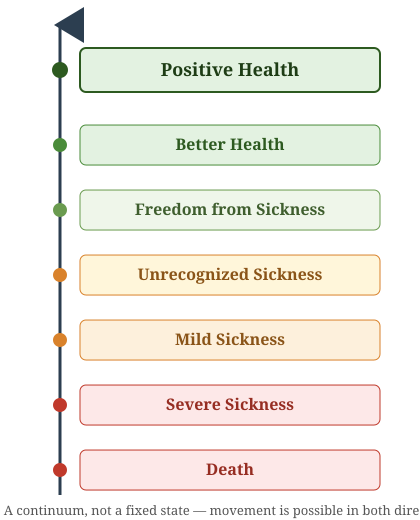
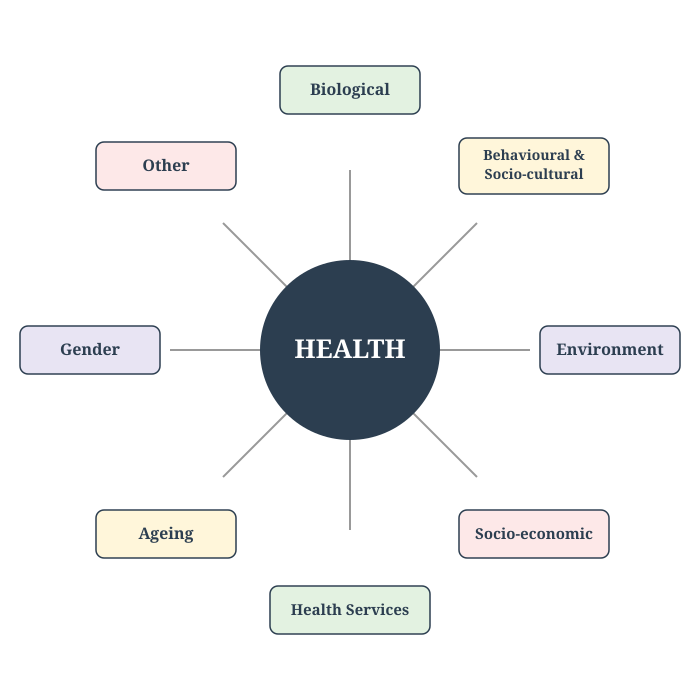
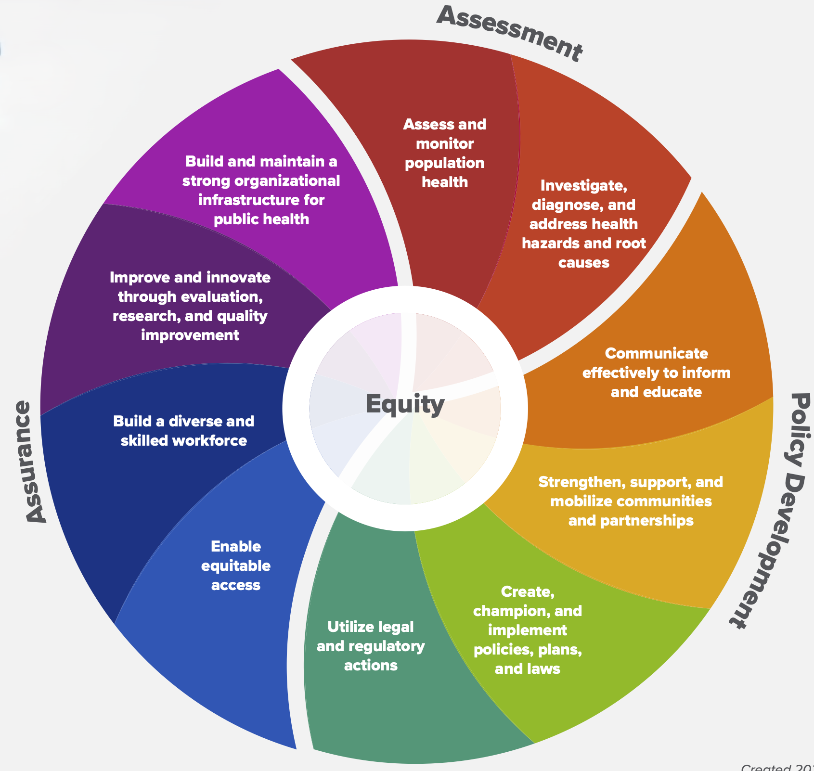
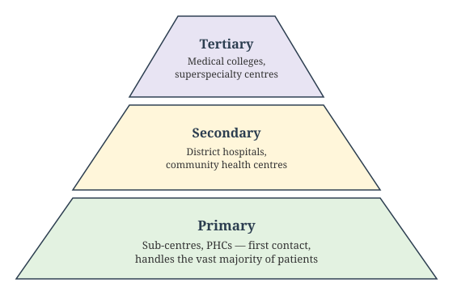
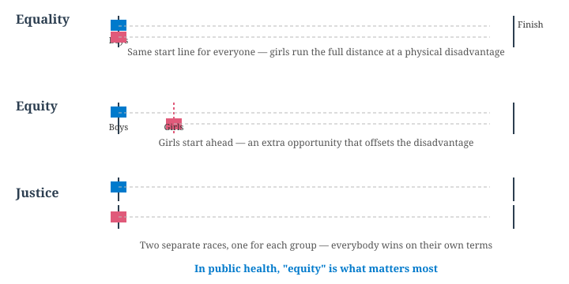

## Welcome {#home}

### Concept of Health and Disease

**Learning Objectives:**

- Compare the biomedical, ecological, psychosocial, and holistic models
  of health
- Define disease and distinguish it from illness and sickness
- Describe the epidemiological triad of agent, host, and environment
- Explain the natural history of disease and its phases
- Describe the iceberg phenomenon of disease
- Apply the levels of prevention — primordial, primary, secondary, tertiary
- Distinguish Koch's postulates from the Bradford Hill criteria of causation
- Classify indicators of health and describe the PQLI and HDI
- State who is responsible for realizing the right to health

**NMC Community Medicine Code:** CM1

🟢 **MUST KNOW** · 🟡 **SHOULD KNOW** · 🟣 **MAY KNOW** · 🧡 **QUESTION**

::: {.notes}
This chapter builds directly on Chapter 1's determinants-of-health
framework: here we formalize how disease actually develops and how
prevention maps onto that process.
:::

---

## Lecture 1: Concept of Health {background-color="#E6EEF5"}

📚 **Lecture 1 of 3** · **CM1.L1**

*Naming and scope of community/preventive/social medicine; concept,
definitions, and dimensions of health; well-being and quality-of-life
indices (PQLI, HDI); determinants of health; right to health and
responsibility for health; India's health status*

---

## Evolution and Scope of Community Medicine {background-color="#E3F2E1"}

🟢 **MUST KNOW**

Community Medicine broadens the scope of medicine from the **individual** to the **community**.  
It integrates **preventive, promotive, curative, and rehabilitative** services through organized efforts.

**Core idea:** Health is achieved not only by treating disease but by improving living conditions, sanitation, nutrition, and education.

---

## Hygiene, Preventive, and Social Medicine {background-color="#FFF6DA"}

🟡 **SHOULD KNOW**

| Field | Focus | Example |
|-------|--------|----------|
| **Hygiene** | Personal and environmental cleanliness | Hand‑washing, safe water |
| **Preventive Medicine** | Preventing disease before it occurs | Immunization, screening |
| **Social Medicine** | Studying social causes of disease | Poverty, housing, education |
| **Community Medicine** | Applying all these at population level | National health programs |

**Key link:** Preventive medicine acts at the *individual level*; social medicine acts at the *societal level*; community medicine integrates both.

---

## Public Health: Definition and Functions {background-color="#E3F2E1"}

🟢 **MUST KNOW**

> "The science and art of preventing disease, prolonging life, and promoting physical health and efficiency **through organized community efforts** for the sanitation of the environment, the control of community infections, the education of the individual in principles of personal hygiene, the organization of medical and nursing services for early diagnosis and preventive treatment of disease, and the development of social machinery which will ensure every individual a standard of living adequate for the maintenance of health." — **C.E.A. Winslow, 1920**

**Functions:**
- Health promotion through education  
- Disease prevention via immunization  
- Health restoration through medical care  
- Rehabilitation of the handicapped  

**Aim:** Create conditions for good health — aligning with WHO’s 1948 definition.

---

## Difference Between Community Medicine, Family Medicine, Preventive Medicine, and Social Medicine {background-color="#E3F2E1"}

🟢 **MUST KNOW**

| Aspect | **Community Medicine** | **Family Medicine** | **Preventive Medicine** | **Social Medicine** |
|--------|------------------------|---------------------|-------------------------|---------------------|
| **Unit of focus** | Community/population | Family & individual across lifespan | Individual risk factors | Society & social determinants |
| **Scope** | Epidemiology, health programs, PHC, public health | Continuity of care, holistic family-centered practice | Immunization, screening, prophylaxis | Links health with social, economic, cultural context |
| **Approach** | Population-based interventions | Person-centered, longitudinal care | Disease prevention before onset | Understanding social causes of disease |
| **Examples** | National immunization program, sanitation drives | Managing diabetes in a family context | Vaccination, health check-ups | Studying impact of poverty on TB outcomes |

---

## Evolution of Medicine {background-color="#FFF6DA"}

🟡 **SHOULD KNOW**

Medicine's scope has widened in stages:

1.  **Curative medicine** — treating disease in the individual patient
2.  **Preventive medicine** — stopping disease before it starts (e.g. immunization, screening)
3.  **Social medicine** — recognizing that disease has social causes and consequences, not only biological ones
4.  **Community medicine / Public health** — shifting the unit of concern from the individual patient to the **community** as a whole

Each stage didn't replace the one before it — modern health systems practice all four simultaneously, for different needs.

---

## Concepts of Health: Four Models {background-color="#E3F2E1"}

🟢 **MUST KNOW**

The concept of health evolved from a narrow, disease-focused view
toward an ever-broader one — each model added a layer the earlier
model could not explain:

| Model | Core idea |
|---|---|
| **Biomedical** | Health = absence of disease; rooted in 19th-century germ theory. Oldest, narrowest — ignores social/environmental/psychological factors |
| **Ecological** | Health = a dynamic equilibrium between humans and environment; disease = a maladjustment ("imperfect man" meets "imperfect environment") |
| **Psychosocial** | Health is shaped by social, psychological, cultural, economic, and political factors, not biology alone |
| **Holistic** | A synthesis of all three — every sector affects health; the broadest model, underlying the WHO's 1948 definition |

**Exam tip:** biomedical → ecological → psychosocial → holistic is both the historical order and the order of increasing breadth.

---

## WHO's Definition and the Operational Definition of Health {background-color="#E3F2E1"}

🟢 **MUST KNOW**

**WHO Constitution (1948):**

> "Health is a state of complete physical, mental and social well-being and not merely the absence of disease or infirmity."

This definition has never been formally amended. Two things make it radical for its time:

- It rejects the purely **biomedical** view (health = absence of disease)
- It names **three dimensions at once** — physical, mental, social — as jointly necessary

**The "new philosophy" of health:** later thinking reframed health
from a *state* to be achieved into a **resource for living** — the
Ottawa Charter (1986) put it directly: *"health is a resource for
everyday life, not the objective of living."*

**An operational definition** (for measurement and health-system
planning, since "complete well-being" cannot itself be measured):
health = the ability of an individual to function normally in the
roles and tasks for which they have been socialized, assessed through
**measurable indicators** — mortality, morbidity, disability, and
functional-capacity data — rather than through the ideal state itself.

::: notes
Drafted at the International Health Conference, New York, 1946; the WHO Constitution entered into force on 7 April 1948 (now marked annually as World Health Day).
:::

---

## Dimensions of Health {background-color="#E3F2E1"}

🟢 **MUST KNOW**

::::: columns
::: {.column width="50%"}
**Core dimensions:**

- **Physical** — normal structure and function of the body
- **Mental** — a state of balance with oneself and one's environment
- **Social** — harmony with the social fabric: family, community, work
- **Spiritual** — a sense of purpose, values, or belief
- **Emotional** — the ability to recognize and appropriately express feelings
- **Vocational** — satisfaction and productive engagement in one's work or occupation
:::

::: {.column width="50%"}
**Extended taxonomy (textbooks add):**

- **Philosophical** — a consistent personal philosophy of life
- **Cultural** — practices and beliefs shaped by one's culture
- **Socio-economic** — income, occupation, and social standing
- **Environmental** — the quality of the physical surroundings
- **Educational** — access to and benefit from education
- **Nutritional** — adequacy of diet and nutritional status
- **Curative** — availability of treatment when illness occurs
- **Preventive** — protection against disease before it occurs
:::
:::::

**Why this matters:** a person can be free of diagnosable disease and
still not be "healthy" by this definition — e.g. someone who is
physically fit but socially isolated or under chronic mental distress.

---

## The Spectrum of Health {background-color="#E3F2E1"}

🟢 **MUST KNOW**

Health is not a fixed state but a **continuum**, moving in both directions between death and positive health:

{.slide-img .nostretch width="230px"}

**Positive health** implies resilience and reserve capacity to cope with stress; public health aims to shift populations **toward** it, not just treat people once they've crossed into illness.

---

## Determinants of Health: The Full Picture {background-color="#E3F2E1"}

🟢 **MUST KNOW**

The classic Blum/Lalonde model names four domains; Indian teaching extends this to eight:

{.slide-img .nostretch width="360px"}

**Key implication:** health-care services are only *one* of eight determinants, and historically not the largest.

::: notes
This is the Blum/Lalonde-style "health field concept," standard across Indian community-medicine teaching, extended with ageing and gender as further recognized determinants (see next slide for the political/developmental dimension).
:::

---

## Determinants of Health: Political, Developmental, and Ecological Dimensions {background-color="#FFF6DA"}

🟡 **SHOULD KNOW**

- **Political determinants** — resource allocation, manpower policy,
  and how accessible health services are made to different segments of
  society are all shaped by a country's political system; WHO's target
  is ≥5% of GNP spent on health (India currently spends about 2%)
- **Health and development** — health is not merely an *outcome* of
  development, it is an *input* to it. Health services are one
  subsystem within the broader socio-economic system, and human health
  and well-being are treated as an ultimate goal of development, not a
  byproduct
- **Ecology of health** — the ecological model (Four Models slide)
  frames health as a dynamic balance between man, agent, and
  environment; a change in any one element (a new pathogen, a polluted
  water source, a crowded settlement) can tip that balance toward
  disease

---

## Positive Health and the Relative Concept of Health {background-color="#E3F2E1"}

🟢 **MUST KNOW**

- **Positive health** is more than "not sick" — Hippocrates linked it
  to genetics, diet, and exercise; it predicts longer life, lower
  health spending, and better prognosis during illness
- **Wellness** — a state of good health actively pursued through
  healthy-lifestyle choices — is commonly described across **six
  dimensions**: physical, emotional, intellectual, social, occupational,
  and spiritual
- **Well-being** has two components: a **subjective** one (quality of
  life — how happy a person feels about their life) and an **objective**
  one (standard/level of living — income, housing, sanitation,
  education, and health-care access)
- **"Relativeness" of health:** health is not one fixed ideal state —
  it is relative to community, race, and genetic make-up. Example: the
  average height of Gurkhas from Nepal (~162 cm) is far below that of
  Scottish highlanders (~180 cm), yet both populations are equally
  healthy and physically fit for their own build — a reminder not to
  mistake population variation for disease

---

## Concept of Well-Being: Standard of Living, Level of Living, and Quality of Life {background-color="#FFF6DA"}

🟡 **SHOULD KNOW**

Three related but distinct terms describe how "doing well" is measured:

| Term | What it measures | Nature |
|---|---|---|
| **Standard of living** | The material comfort and wealth a population could or should have — income, possessions, affordability | Normative / aspirational benchmark |
| **Level of living** | The conditions people actually experience: food, housing, health, education, leisure, social security | Descriptive, measured (e.g. UN's Level-of-Living Index, 9 components) |
| **Quality of life** | A broader, more subjective measure of life satisfaction and well-being — physical, psychological, and social | Holistic and subjective (WHOQOL) |

**Well-being** itself has two components: a **subjective** one (how
happy a person feels about their life — quality of life) and an
**objective** one (standard/level of living — income, housing,
sanitation, education, and health-care access).

---

## PQLI and HDI: Composition and Formula {background-color="#E8E4F3"}

🟣 **MAY KNOW**

Two composite indices built to summarize development/well-being in a
single number:

| Index | Components | Scale |
|---|---|---|
| **Physical Quality of Life Index (PQLI)** | Infant mortality + life expectancy at age 1 + literacy, equally weighted | 0 (worst) – 100 (best) |
| **Human Development Index (HDI)** | Life expectancy at birth + education (mean/expected years of schooling) + GNI per capita (PPP US\$) | 0 – 1 |

Both consolidate outcome measures rather than inputs, and both allow
country-to-country comparison over time — HDI is the more widely cited
today (UNDP's Human Development Report).

**Related indices:** the **Human Poverty Index (HPI)**, **Gender-related
Development Index (GDI)**, and **Gender Empowerment Measure (GEM)**
extend the same idea to deprivation and gender-specific development —
all complementary to, not replacements for, PQLI/HDI.

---

## PQLI/HDI Worked Example and India's Current Standing {background-color="#E8E4F3"}

🟣 **MAY KNOW**

**How HDI is calculated:** HDI is the **geometric mean** of three
normalized sub-indices, each scaled 0–1 using (actual − minimum) /
(maximum − minimum):

- **Life Expectancy Index** — from life expectancy at birth
- **Education Index** — mean years of schooling + expected years of schooling
- **Income Index** — log of GNI per capita (PPP US\$)

**India's current standing** (UNDP *Human Development Report*, 2025
edition, using 2023 data):

- **HDI value: 0.685** — up from 0.676 the previous year
- **Global rank: 130 of 193** countries — improved from rank 133
- **Category:** Medium Human Development, approaching the High
  Human Development threshold (HDI ≥ 0.700)
- **Life expectancy at birth: 72.0 years** — highest ever recorded for India
- Inequality reduces India's HDI by about **30.7%** when adjusted (the Inequality-adjusted HDI, IHDI)

*Figures retrieved via web search this session; check the latest UNDP report for current numbers.*

---

## Right to Health and Responsibility for Health {background-color="#E8E4F3"}

🟣 **MAY KNOW**

The WHO Constitution was the first instrument to formally recognize
health as a right: *"the enjoyment of the highest attainable standard of
health is one of the fundamental rights of every human being, without
distinction of race, religion, political belief, economic or social
condition."*

Responsibility for realizing that right is shared across four levels:

- **Individual** — self-care: the health decisions and habits a person
  controls directly
- **Community** — participates through manpower/resources, through
  planning–management–evaluation, and simply by using health services
- **State** — in India, health is constitutionally a state subject; the Constitution's **Part IV (Directive Principles of State Policy)**, **Article 47**, directs the State to regard "the raising of the level of nutrition and the standard of living of its people and the improvement of public health" as among its primary duties — not legally enforceable in court, but fundamental in governance
- **International** — cooperation between governments and bodies inside
  and outside the UN system (e.g. exchange of experts, drugs and
  supplies, cross-border communicable disease control)

---

## Health Status of India: The NITI Aayog View {background-color="#FFF6DA"}

🟡 **SHOULD KNOW**

NITI Aayog's **SDG India Index** tracks the country's progress against
all 17 Sustainable Development Goals using over 100 national indicators:

- **Overall SDG India Index score (2023–24): 71 / 100** — up from 66
  in 2020–21 and 57 in the baseline year 2018, moving India toward
  "Front-Runner" status
- **SDG 3 (Good Health and Well-being) goal score: 77 / 100** — driven
  by gains in immunization coverage, institutional deliveries, and
  rising life expectancy

**Scoring bands:** Aspirant (0–49) · Performer (50–64) ·
Front-Runner (65–99) · Achiever (100)

*Figures retrieved via web search during this session; check the
latest NITI Aayog SDG India Index report for the current edition.*

---

## Developed vs Developing Countries: Contrasting Health Profiles {background-color="#FFF6DA"}

🟡 **SHOULD KNOW**

| Feature | Developed countries | Developing countries (e.g. India) |
|---|---|---|
| **Disease burden** | Dominated by non-communicable diseases (NCDs) — cardiovascular disease, cancer, diabetes | **Double burden**: persisting communicable diseases alongside a fast-rising NCD burden |
| **Population structure** | Ageing population; low birth rates | Younger population; birth rate declining but still comparatively high |
| **Health expenditure** | High, often >8–10% of GDP | Lower, India currently spends approximately 2% of GDP on health |
| **Maternal and child health** | Low maternal/infant mortality | Higher, though rapidly improving (India's IMR has fallen from 129 in 1971 to 25 in 2023) |
| **Health infrastructure** | Dense, well-staffed, tertiary-care-heavy | Uneven, concentrated in urban centres, primary-care gaps in rural areas |

Community Medicine in India must address *both* ends of this table at
once — a double burden of disease layered onto resource constraints.

---

## The Urban–Rural Health Divide {background-color="#FFF6DA"}

🟡 **SHOULD KNOW**

India's health indicators consistently show a gap between urban and
rural populations. India's **Infant Mortality Rate (IMR), 2023 SRS**:

| Area | IMR (per 1,000 live births) |
|---|---|
| **National** | 25 |
| **Rural** | 28 |
| **Urban** | 18 |

**Why the gap persists:** lower density and reach of health facilities
in rural areas, longer travel times to care, lower health-worker
density, poorer sanitation and water-supply infrastructure in some
regions, and lower health literacy/awareness — all are determinants
of health (previous slides) operating unevenly across the urban-rural
divide.

*Figures from the Sample Registration System (SRS) Statistical Report
2023, retrieved via web search during this session.*

---

## Self-Check: Question 1 {background-color="#FDE8E8"}

🧡 **QUESTION**

::: quiz-question
### Question 1

According to the WHO Constitution, health is a state of complete physical, mental, and social well-being and:

- A state achieved only after recovering from an illness
- [Not merely the absence of disease or infirmity]{.correct data-explanation="This is the exact WHO Constitution (1948) wording — health is defined positively, not just as the absence of disease."}
- The same as having access to good hospitals
- A purely subjective, unmeasurable feeling
:::

---

## Self-Check: Question 2 {background-color="#FDE8E8"}

🧡 **QUESTION**

::: quiz-question
### Question 2

In the health-field / determinants-of-health model used in this chapter, which of the following is **one of the four** domains?

- Political ideology
- [Heredity / biology]{.correct data-explanation="The four domains are environment, heredity/biology, lifestyle, and health services."}
- Climate change policy
- International trade
:::

---

## Self-Check: Question 3 {background-color="#FDE8E8"}

🧡 **QUESTION**

::: quiz-question
### Question 3

Which stage in the evolution of medicine shifts the unit of concern from the individual patient to the community as a whole?

- Curative medicine
- Preventive medicine
- Social medicine
- [Community medicine / Public health]{.correct data-explanation="Community medicine explicitly treats the community, not the individual patient, as the unit of concern."}
:::

---

## Self-Check: Question 4 {background-color="#FDE8E8"}

🧡 **QUESTION**

::: quiz-question
### Question 4

Community medicine primarily differs from clinical medicine in that it focuses on:

- Individual patient care
- Hospital-based management
- [Health of populations]{.correct data-explanation="Clinical medicine focuses on the individual patient; community medicine's unit of concern is the population."}
- Curative services only
:::

---

## Self-Check: Question 5 {background-color="#FDE8E8"}

🧡 **QUESTION**

::: quiz-question
### Question 5

Which of the following best reflects the scope of community medicine?

- Diagnosis and treatment
- Rehabilitation only
- [Prevention, promotion, and protection of health]{.correct data-explanation="Community medicine's scope spans prevention, promotion, and protection of health at the population level — not just diagnosis, treatment, or rehabilitation alone."}
- Emergency care
:::

---

## Self-Check: Question 6 {background-color="#FDE8E8"}

🧡 **QUESTION**

::: quiz-question
### Question 6

The term "Community Medicine" places its central emphasis on:

- Diagnosis and treatment of individual patients
- [The community/population as the unit of care, not the individual]{.correct data-explanation="Community Medicine shifts the unit of concern from the individual patient to the community/population as a whole."}
- Advanced laboratory investigations
- Hospital bed-occupancy management
:::

---

## Self-Check: Question 7 {background-color="#FDE8E8"}

🧡 **QUESTION**

::: quiz-question
### Question 7

A district health officer, on noticing a cluster of diarrhoeal cases in a village, organizes house-to-house surveys, tests drinking-water sources, and conducts health education sessions. This set of activities best illustrates:

- Clinical case management
- [Applied community medicine practice in the field]{.correct data-explanation="Investigating a cluster at the population level with surveys, environmental testing, and health education is community medicine practice in action."}
- Hospital infection control
- Individual patient counselling
:::

---

## Self-Check: Question 8 {background-color="#FDE8E8"}

🧡 **QUESTION**

::: quiz-question
### Question 8

The primary purpose of field visits during the Community Medicine posting is to:

- Fulfil attendance requirements only
- [Study health problems and services in their real community setting]{.correct data-explanation="Field visits let students see community health problems, determinants, and services first-hand, beyond what is taught in the classroom."}
- Practice surgical procedures
- Conduct hospital ward rounds
:::

---

## Self-Check: Question 9 {background-color="#FDE8E8"}

🧡 **QUESTION**

::: quiz-question
### Question 9

Community Medicine contributes most directly to national health development by:

- Running private specialty clinics
- [Planning, implementing, and evaluating public health programmes]{.correct data-explanation="Community Medicine specialists are centrally involved in designing, delivering, and evaluating the public health programmes that drive national health development."}
- Publishing case reports only
- Training only surgical residents
:::

---

## Self-Check: Question 10 {background-color="#FDE8E8"}

🧡 **QUESTION (select ALL that apply)**

::: {.quiz-question .quiz-multiple}
### Question 10

Which of the following are recognized functions of Community Medicine?

- [Prevention and control of disease in populations]{.correct}
- Marketing pharmaceutical products
- [Promotion of health through education and intersectoral action]{.correct}
- Maximizing hospital revenue
:::

---

## Self-Check: Question 11 {background-color="#FDE8E8"}

🧡 **QUESTION (select ALL that apply)**

::: {.quiz-question .quiz-multiple}
### Question 11

Community Medicine integrates knowledge and methods from which of the following disciplines?

- [Epidemiology and biostatistics]{.correct}
- [Social and behavioural sciences]{.correct}
- Corporate financial accounting
- Automotive engineering
:::

---

## Self-Check: Question 12 {background-color="#FDE8E8"}

🧡 **QUESTION**

::: quiz-question
### Question 12

**Assertion (A):** Community Medicine serves as a bridge between clinical medicine and the social sciences.

**Reason (R):** The WHO was founded in 1948 with its headquarters in Geneva.

- A is true, R is false
- A is false, R is true
- [Both A and R are true, but R is NOT the correct explanation of A]{.correct data-explanation="Both statements are independently true, but the founding date and location of WHO has nothing to do with explaining why Community Medicine bridges clinical medicine and social sciences."}
- Both A and R are false
:::

---

## Self-Check: Question 13 {background-color="#FDE8E8"}

🧡 **QUESTION**

::: quiz-question
### Question 13

Which of the following is **NOT** a valid point of difference between curative and preventive medicine?

- Curative medicine treats existing disease; preventive medicine averts future disease
- [Both curative and preventive medicine are entirely unconcerned with the community]{.correct data-explanation="This statement is false — preventive medicine (and increasingly curative practice) is very much concerned with the community; it is the invalid claim among the options."}
- Curative medicine is individual-oriented; preventive medicine is population-oriented
- Curative medicine acts after disease onset; preventive medicine acts before onset
:::

---

## Self-Check: Question 14 {background-color="#FDE8E8"}

🧡 **QUESTION**

::: quiz-question
### Question 14

The physical, mental, and social aspects within the WHO's definition of health are collectively referred to as its:

- Determinants
- Indicators
- [Dimensions (subdomains) of health]{.correct}
- Indices
:::

---

## Self-Check: Question 15 {background-color="#FDE8E8"}

🧡 **QUESTION**

::: quiz-question
### Question 15

Many scholars argue that the original WHO definition of health omits a dimension that has since been widely proposed as a fourth component. Which dimension is this?

- Physical
- Mental
- Social
- [Spiritual]{.correct data-explanation="The original WHO definition names only physical, mental, and social well-being; a spiritual dimension has since been widely proposed as a fourth component, though not formally adopted into the Constitution."}
:::

---

## Self-Check: Question 16 {background-color="#FDE8E8"}

🧡 **QUESTION**

::: quiz-question
### Question 16

The most widely cited standard definition of Public Health was given by:

- [C.E.A. Winslow]{.correct}
- Hippocrates
- John Snow
- Edwin Chadwick
:::

---

## Self-Check: Question 17 {background-color="#FDE8E8"}

🧡 **QUESTION**

::: quiz-question
### Question 17

The discipline of "Social Medicine" is chiefly associated with the pioneering work of:

- [Alfred Grotjahn]{.correct}
- John Snow
- Edwin Chadwick
- C.E.A. Winslow
:::

---

## Self-Check: Question 18 {background-color="#FDE8E8"}

🧡 **QUESTION**

::: quiz-question
### Question 18

A health-care system in which the government funds and provides medical care to all citizens free at the point of use is best described as:

- Community medicine
- Private insurance-based medicine
- [Socialized (state) medicine]{.correct}
- Family medicine
:::

---

## Self-Check: Question 19 {background-color="#FDE8E8"}

🧡 **QUESTION**

::: quiz-question
### Question 19

Which of the following best describes Community Medicine?

- Focuses only on hospital-based curative care
- [Integrates preventive, promotive, curative, and rehabilitative care]{.correct data-explanation="Community Medicine applies all aspects of health care — preventive, promotive, curative, and rehabilitative — at the population level through organized efforts."}
- Deals only with sanitation and hygiene
- Concerned solely with family-level care
:::

---

## Self-Check: Question 20 {background-color="#FDE8E8"}

🧡 **QUESTION (select ALL that apply)**

::: {.quiz-question .quiz-multiple}
### Question 20

Which of the following belong to the **extended taxonomy** of health dimensions (beyond the six core dimensions)?

- [Philosophical]{.correct}
- Physical
- [Cultural]{.correct}
- Mental
:::

---

## Self-Check: Question 21 {background-color="#FDE8E8"}

🧡 **QUESTION**

::: quiz-question
### Question 21

The "level of living" index, as distinct from "standard of living," measures:

- Aspirational material wealth a population could have
- [The actual living conditions people experience — food, housing, health, education]{.correct data-explanation="Level of living is descriptive, measuring real conditions people experience (e.g. the UN's Level-of-Living Index), unlike standard of living, which is a normative/aspirational benchmark."}
- Subjective life satisfaction alone
- GDP per capita alone
:::

---

## Self-Check: Question 22 {background-color="#FDE8E8"}

🧡 **QUESTION**

::: quiz-question
### Question 22

According to the most recent UNDP Human Development Report, India's HDI places it in which category?

- Low Human Development
- [Medium Human Development, approaching the High-HD threshold]{.correct data-explanation="India's HDI value of 0.685 (2023 data) places it in the Medium Human Development category, just below the High threshold of 0.700."}
- High Human Development
- Very High Human Development
:::

---

## Self-Check: Question 23 {background-color="#FDE8E8"}

🧡 **QUESTION**

::: quiz-question
### Question 23

On the spectrum of health, which point sits immediately before "Positive Health"?

- Freedom from Sickness
- [Better Health]{.correct data-explanation="The spectrum runs Death → Severe Sickness → Mild Sickness → Unrecognized Sickness → Freedom from Sickness → Better Health → Positive Health."}
- Unrecognized Sickness
- Mild Sickness
:::

---

## Self-Check: Question 24 {background-color="#FDE8E8"}

🧡 **QUESTION**

::: quiz-question
### Question 24

India's overall SDG India Index score for 2023–24, as reported by NITI Aayog, was approximately:

- 57
- 66
- [71]{.correct data-explanation="NITI Aayog's SDG India Index 2023–24 reported an overall score of 71, up from 66 in 2020–21 and 57 in the 2018 baseline."}
- 85
:::

---

## Self-Check: Question 25 {background-color="#FDE8E8"}

🧡 **QUESTION**

::: quiz-question
### Question 25

The extended determinants-of-health wheel used in this lecture adds which two domains to the classic four (environment, heredity/biology, lifestyle, health services)?

- Religion and language
- [Ageing and gender]{.correct data-explanation="Indian community-medicine teaching commonly extends the classic four-domain model with ageing and gender as further recognized determinants."}
- Climate and geography
- Technology and industry
:::

---

## Self-Check: Question 26 {background-color="#FDE8E8"}

🧡 **QUESTION**

::: quiz-question
### Question 26

Which article of the Indian Constitution, under the Directive Principles of State Policy (Part IV), directs the State to regard the improvement of public health as among its primary duties?

- Article 21
- Article 32
- [Article 47]{.correct data-explanation="Article 47 (Part IV, Directive Principles of State Policy) directs the State to raise nutrition levels, the standard of living, and improve public health, though it is not legally enforceable in court."}
- Article 14
:::

---

## Lecture 2: Concept of Disease and Prevention {background-color="#E6EEF5"}

📚 **Lecture 2 of 3** · **CM1.L2**

*Concept of disease and causation, natural history of disease, levels
of prevention, modes of intervention*

---

## Disease, Illness, and Sickness {background-color="#E3F2E1"}

🟢 **MUST KNOW**

These three words are often used interchangeably but mean different
things in community medicine:

- **Disease** — an objective, measurable deviation from normal structure
  or function of the body, detectable by clinical or laboratory means
- **Illness** — the *subjective* experience of feeling unwell, as
  perceived by the person themselves
- **Sickness** — the *social* dimension: society's recognition that a
  person is unwell (e.g. being excused from work)

**Why the distinction matters:** a person can have disease without
illness (asymptomatic infection), or feel ill without demonstrable disease
— both are relevant to how and when a health system responds.

---

## The Epidemiological Triad {background-color="#E3F2E1"}

🟢 **MUST KNOW**

Disease results from an interaction between three factors:

:::: {.columns}
::: {.column width="33%"}
**Agent**

The factor whose presence (or excess/deficiency) is necessary for
disease — biological (bacteria, virus), chemical, physical, nutritional,
or mechanical
:::

::: {.column width="33%"}
**Host**

The organism that harbours disease — human factors like age, sex,
immunity, genetics, and behaviour affect susceptibility
:::

::: {.column width="33%"}
**Environment**

External conditions that bring agent and host together — physical,
biological, and socio-economic environment
:::
::::

Disease occurs when this triad is out of balance — a change in any one
factor can tip the balance toward or away from disease.

---

## Natural History of Disease {background-color="#E3F2E1"}

🟢 **MUST KNOW**

The natural history of disease is how a disease would progress over time
**without any intervention** — from first cause to final outcome. It has
two broad phases:

1. **Pre-pathogenesis phase** — the disease agent exists in the
   environment, but has not yet entered the human host; risk factors are
   accumulating
2. **Pathogenesis phase** — begins once the agent enters a susceptible
   host: incubation → early (subclinical) pathogenesis → clinical disease
   → outcome (recovery, disability, or death)

**Key idea:** prevention is most effective the *earlier* it acts in this
timeline — this is exactly what the levels of prevention (next slides)
are built around.

---

## The Iceberg Phenomenon {background-color="#E3F2E1"}

🟢 **MUST KNOW**

Clinically diagnosed cases in a community are often only the **visible
tip** of the true disease burden:

`Visible: clinically diagnosed, reported cases`
`Hidden (below the surface): sub-clinical, undiagnosed, and unreported cases — often the majority`

**Implication:** relying only on reported/diagnosed cases underestimates
the real scale of a disease in a population — this is why screening and
active surveillance matter (screening is covered in a later Foundations
chapter).

---

## Levels of Prevention {background-color="#E3F2E1"}

🟢 **MUST KNOW**

Prevention is classified by **when** it intervenes in the natural history
of disease:

| Level | Target | Example |
|---|---|---|
| **Primordial** | Prevents risk factors from ever emerging | Anti-tobacco social norms in children who don't smoke yet |
| **Primary** | Prevents disease onset in exposed/at-risk people | Vaccination, health education |
| **Secondary** | Detects and treats disease early, before it's clinically obvious | Cancer screening, early diagnosis |
| **Tertiary** | Limits disability and aids rehabilitation once disease is established | Physiotherapy after stroke, disease-management programs |

**Exam tip:** Primordial ≠ Primary. Primordial acts on *risk factors
before they exist*; Primary acts once risk/exposure is already present
but before disease develops.

---

## Multifactorial Causation {background-color="#E3F2E1"}

🟢 **MUST KNOW**

Most disease — especially non-communicable disease — does not have a
single cause. The **web of causation** model shows disease arising from
an interconnected network of contributing factors (biological, behavioural,
environmental, social), rather than one agent producing one disease.

**Contrast with infectious disease:** classical infectious disease
causation (one specific agent → one specific disease) is closer to a
single-cause model — which is exactly what Koch's postulates were built
to test.

---

## Koch's Postulates {background-color="#FFF6DA"}

🟡 **SHOULD KNOW**

Robert Koch's 19th-century criteria for proving a microorganism causes a
specific disease:

1. The organism must be found in **all** cases of the disease, and absent
   in healthy individuals
2. It must be **isolated** from the diseased host and grown in pure
   culture
3. The cultured organism must **reproduce the disease** when introduced
   into a healthy, susceptible host
4. The organism must be **re-isolated** from that newly infected host and
   shown to be identical to the original

**Limitation:** doesn't work for viruses, asymptomatic carriers, or
diseases with multiple contributing causes — one reason Bradford Hill's
criteria were later developed for broader causal inference.

---

## Bradford Hill Criteria of Causation {background-color="#FFF6DA"}

🟡 **SHOULD KNOW**

Sir Austin Bradford Hill (1965) proposed nine viewpoints to judge whether
an *association* found in epidemiological studies is likely *causal*:

1. **Strength** of association
2. **Consistency** across studies/populations
3. **Specificity** of the effect
4. **Temporality** — cause precedes effect (the only criterion considered
   truly essential)
5. **Biological gradient** — dose–response relationship
6. **Plausibility**
7. **Coherence** with existing knowledge
8. **Experiment** — evidence from intervention/removal of the exposure
9. **Analogy** with similar known causal relationships

**Used for:** non-communicable disease and environmental exposures, where
Koch's postulates don't apply.

---

## Risk Factors {background-color="#FFF6DA"}

🟡 **SHOULD KNOW**

A **risk factor** is any attribute, exposure, or characteristic that
increases the probability of disease, without necessarily being a
sufficient or direct cause.

- **Non-modifiable** — age, sex, genetic makeup, family history
- **Modifiable** — smoking, diet, physical inactivity, blood pressure,
  occupational exposure

Public health prevention strategy focuses on **modifiable** risk factors,
since non-modifiable ones can only inform risk stratification, not
intervention.

---

## Lecture 3: Indicators of Health {background-color="#E6EEF5"}

📚 **Lecture 3 of 3** · **CM1.L3**

*Indicators of health; demographic profile of India and its impact;
MDG to SDG*

---

## Community Diagnosis {background-color="#FFF6DA"}

🟡 **SHOULD KNOW**

| Aspect | Clinical Diagnosis | Community Diagnosis |
|--------|---------------------|----------------------|
| Made by | Doctor | Epidemiologist |
| Concerned with | Individual | Defined population |
| Scope | Only sick | Both sick and healthy |
| Purpose | Decide treatment | Plan prevention and promotion |
| Follow-up | Case | Program |

**Stages:** Data collection and analysis → Interpretation → Dissemination → Action

**Relevance:** Identifies community health problems, sets priorities, and guides interventions.

---

## Community Diagnosis: Steps and Parameters {background-color="#FFF6DA"}

🟡 **SHOULD KNOW**

**How a community diagnosis is made** (same logic as diagnosing a
patient — history, examination, tests — applied to a population):

1. Collect socio-demographic data (age, sex, education, occupation, income)
2. Collect environmental data (housing, water, sanitation)
3. Identify mortality/morbidity causes and risk factors
4. Distinguish **professionally identified needs** from **felt needs**
5. Write the findings as a short "community diagnosis" statement, then plan **community treatment**

**Parameters used to assess a health service** for that community:
*Relevance, Adequacy, Accessibility, Availability, Affordability, Completeness.*

---

## Community vs Hospital Medicine {background-color="#FFF6DA"}

🟡 **SHOULD KNOW**

| Aspect | Community Medicine | Hospital Medicine |
|--------|---------------------|---------------------|
| Service area | Defined population | Ill-defined catchment |
| Approach | Active outreach | Passive, patient-driven |
| Focus | Prevention and promotion | Curative care |
| Coordination | Intersectoral | Limited |
| Cost-benefit | High (population impact) | Individual outcome |

**Principle:** Prevention is safer, cheaper, and easier than cure.

---

## Social Anatomy, Physiology, Pathology, and Therapy {background-color="#E8E4F3"}

🟣 **MAY KNOW**

| Concept | Analogy | Example |
|---------|---------|---------|
| Social Anatomy | Structure of society | Social stratification, institutions |
| Social Physiology | Functions of society | Education, communication |
| Social Pathology | Abnormalities | Crime, poverty, delinquency |
| Social Therapy | Treatment | Legislation, reform, welfare services |

---

## Essential Public health services {background-color="#E8E4F3"}

🟢 **MUST KNOW**

::::: columns
::: {.column width="70%"}
{.slide-img height="420px"}
:::

::: {.column width="30%"}
1. Monitor health  
2. Diagnose and investigate  
3. Inform, educate, empower  
4. Mobilize community partnerships  
5. Develop policies  
6. Enforce laws  
7. Link to/provide care  
8. Assure competent workforce  
9. Evaluate  
10. Research for new insights
:::
:::::

---

## Primary Health Care: Alma-Ata, 1978 {background-color="#E3F2E1"}

🟢 **MUST KNOW**

At Alma-Ata (in present-day Kazakhstan), 134 WHO member states and 67 organisations adopted a declaration defining Primary Health Care (PHC):

> "Essential health care based on practical, scientifically sound and socially acceptable methods and technology, made universally accessible to individuals and families... through their full participation and at a cost the community and country can afford... the first level of contact of individuals, the family and community with the national health system."

**The goal it set:** *"Health for All by the year 2000"* — a level of health that would let all people lead a socially and economically productive life, with PHC declared the key strategy to reach it.

---

## Levels of Healthcare: Primary, Secondary, Tertiary {background-color="#E3F2E1"}

🟢 **MUST KNOW**

Health-care is delivered through a graded, three-tier system — most needs are met at the base, with progressively fewer patients needing the more specialized tiers above:

{.slide-img .nostretch width="440px"}

---

## Principles of Primary Health Care {background-color="#E3F2E1"}

🟢 **MUST KNOW**

- **Equitable distribution** — care reaches rural and underserved populations, not just cities
- **Community participation** — individuals and communities help plan and run their own care, not just receive it
- **Intersectoral coordination** — health links to agriculture, education, housing, water supply, and rural development
- **Appropriate technology** — methods that are scientifically valid, affordable, and acceptable to the community, not merely the most advanced available

---

## Equality, Equity, and Justice {background-color="#FFF6DA"}

🟡 **SHOULD KNOW**

These three terms are often confused, but public health cares most about **equity**:

{.slide-img .nostretch width="600px"}

**Example:** Ayushman Bharat gives free secondary/tertiary care specifically to the poorest households — the whole population has access to care, but the most disadvantaged get an extra opportunity. That is equity, not mere equality.

---

## Indicators of Health: A Classification {background-color="#FFF6DA"}

🟡 **SHOULD KNOW**

The WHO defines a health indicator as a variable that helps measure
changes which cannot be measured directly. No single indicator captures
"health" — a full profile draws on several categories:

Mortality · Morbidity · Disability · Nutritional status · Health-care
delivery · Utilization · Social/mental health · Environmental ·
Socio-economic · Health policy · Quality of life · Social indicators

**A good indicator should be:** Valid · Reliable · Sensitive · Specific ·
Feasible · Relevant.

DALY, QALY, and the mortality/morbidity indicators used in Indian health
surveillance are covered in depth in Health Information and Basic
Medical Statistics (Chapter 21).

---

## Sufficient-Component Cause Model {background-color="#E8E4F3"}

🟣 **MAY KNOW**

Rothman's "causal pie" model refines the web-of-causation idea: a disease
occurs only when a **sufficient cause** — a full "pie" made of several
**component causes** — is complete. The same disease can have multiple
different sufficient causes (multiple different pies), each built from
different combinations of components. Removing just *one* component
(a "necessary cause," if it appears in every pie) can prevent the disease
even without knowing every other component.

---

## From Miasma to Germ Theory {background-color="#E8E4F3"}

🟣 **MAY KNOW**

- **Miasma theory** (dominant until the 19th century) — believed disease
  spread through "bad air" from decomposing matter; still drove
  genuinely useful sanitation reforms
- **Germ theory** (Pasteur, Koch, late 19th century) — established that
  specific microorganisms cause specific diseases, replacing miasma
  theory and giving rise to modern microbiology and Koch's postulates

---

## Syndemics: A Modern Extension {background-color="#E8E4F3"}

🟣 **MAY KNOW**

A **syndemic** is the concept that two or more diseases (or a disease and
a social condition) cluster together and interact within a population,
each worsening the other — for example, the interaction between
undernutrition, poor sanitation, and infectious disease in the same
vulnerable communities. It extends the web-of-causation idea from a
single disease to interacting epidemics.

---

## Practice Questions: Descriptive {background-color="#FFF6DA"}

**For written practice — work through these on paper; no auto-check for this slide.**

**Long Essay**

1. Define health and discuss the different models/concepts of health — biomedical, ecological, psychosocial, and holistic.
2. Discuss the concept of positive health and describe the various indicators used to measure the health status of a community.

**Short Essay**

3. Describe the dimensions of health.
4. Discuss the spectrum of health and the iceberg phenomenon of disease.
5. Describe the determinants of health, including political determinants.
6. Discuss PQLI and HDI as composite indices of development and health.

**Short Answers / Notes**

7. Write short notes on: (a) Impairment, disability, and handicap (b) Well-being vs wellness (c) Relativeness of health.

## Practice Questions: Descriptive (contd.) {background-color="#FFF6DA"}

**Reasoning Type**

8. Why is health considered a multidimensional and dynamic concept rather than a static, purely biomedical one?
9. Why are objective indicators of health alone considered insufficient to capture the true health status of a population?

**Case Scenario**

10. A 45-year-old man from a low-income household reports feeling constantly fatigued, though clinical investigations show no diagnosable disease. He has been unable to work regularly and feels socially isolated.
    a. Is this individual "healthy" by the biomedical model? Justify.
    b. How would the WHO's definition of health assess this individual?
    c. Which dimension(s) of health are primarily affected?
    d. Where would you place this individual on the health–disease spectrum?
    e. Suggest measures, drawing on the determinants of health, that could improve this individual's health status.

------------------------------------------------------------------------

## Self-Check: Question 1 {background-color="#FDE8E8"}

🧡 **QUESTION**

::: {.quiz-question}
### Question 1

A person feels unwell and is fatigued, but no clinical or laboratory
abnormality can be found. This best describes:

- Disease
- [Illness]{.correct data-explanation="Illness is the subjective, self-perceived experience of feeling unwell, independent of a demonstrable clinical abnormality."}
- Sickness
- Syndemic
:::

---

## Self-Check: Question 2 {background-color="#FDE8E8"}

🧡 **QUESTION**

::: {.quiz-question}
### Question 2

Which of the following is NOT part of the epidemiological triad?

- Agent
- Host
- Environment
- [Outcome]{.correct data-explanation="The epidemiological triad is Agent, Host, and Environment. Outcome is a result of their interaction, not a member of the triad."}
:::

---

## Self-Check: Question 3 {background-color="#FDE8E8"}

🧡 **QUESTION**

::: {.quiz-question}
### Question 3

An anti-smoking campaign aimed at children who have never smoked, to
prevent the smoking habit from ever starting, is an example of:

- Primary prevention
- [Primordial prevention]{.correct data-explanation="Primordial prevention targets the emergence of the risk factor itself (smoking initiation), before any exposure exists — distinct from primary prevention, which acts once exposure/risk is already present."}
- Secondary prevention
- Tertiary prevention
:::

---

## Self-Check: Question 4 {background-color="#FDE8E8"}

🧡 **QUESTION**

::: {.quiz-question}
### Question 4

Physiotherapy and rehabilitation after a stroke, to limit disability, is
an example of:

- Primary prevention
- Secondary prevention
- [Tertiary prevention]{.correct data-explanation="Tertiary prevention aims to limit disability and rehabilitate once disease/damage has already occurred."}
- Primordial prevention
:::

---

## Self-Check: Question 5 {background-color="#FDE8E8"}

🧡 **QUESTION**

::: {.quiz-question}
### Question 5

Which criterion is considered the one truly essential Bradford Hill
criterion for causation?

- Analogy
- Specificity
- [Temporality]{.correct data-explanation="Temporality — the cause must precede the effect — is the only Bradford Hill criterion considered an absolute requirement; the others strengthen, but don't by themselves prove, causation."}
- Coherence
:::

---

## Self-Check: Question 6 {background-color="#FDE8E8"}

🧡 **QUESTION**

::: {.quiz-question}
### Question 6

Koch's postulates are best suited to establishing causation for:

- Chronic non-communicable diseases with multiple risk factors
- [A specific microorganism causing a specific infectious disease]{.correct data-explanation="Koch's postulates were designed to prove that one specific microorganism causes one specific infectious disease — a single-cause model, unlike multifactorial NCDs."}
- Social determinants of health
- Environmental exposures with no identifiable single agent
:::

---

## Self-Check: Question 7 {background-color="#FDE8E8"}

🧡 **QUESTION**

::: {.quiz-question}
### Question 7

The "tip of the iceberg" in the iceberg phenomenon of disease refers to:

- All disease cases in a community, visible and hidden
- [Only the clinically diagnosed, reported cases]{.correct data-explanation="The visible tip represents diagnosed and reported cases; the much larger hidden portion below the surface represents sub-clinical and undiagnosed cases."}
- Only fatal cases
- Cases prevented by primordial prevention
:::

---

## Self-Check: Question 8 {background-color="#FDE8E8"}

🧡 **QUESTION**

::: {.quiz-question}
### Question 8

A person with hearing loss is unable to communicate effectively but can still perform most daily activities. This condition is best termed as:

- Disease
- [Impairment]{.correct data-explanation="A loss or abnormality of structure/function (like hearing loss) that doesn't fully prevent daily activities is an impairment; disability describes a resulting restriction in performing tasks, and handicap describes the social disadvantage that follows."}
- Disability
- Handicap
:::

---

## Self-Check: Question 9 {background-color="#FDE8E8"}

🧡 **QUESTION**

::: {.quiz-question}
### Question 9

The concept of positive health mainly refers to:

- Absence of symptoms
- Ability to perform daily activities
- [Optimal functioning of the individual]{.correct data-explanation="Positive health goes beyond just being symptom-free or functional — it means optimal physical, mental, and social functioning, with reserve capacity to cope with stress."}
- Lack of disability
:::

---

## Self-Check: Question 10 {background-color="#FDE8E8"}

🧡 **QUESTION**

::: {.quiz-question}
### Question 10

A patient has early-stage hypertension detectable only through blood pressure measurement, with no symptoms and normal daily functioning. This best illustrates:

- Clinical disease
- [Subclinical disease]{.correct data-explanation="A subclinical disease is present and measurable (e.g., raised BP) but produces no symptoms and no disruption of normal functioning."}
- Disability
- Handicap
:::

---

## Self-Check: Question 11 {background-color="#FDE8E8"}

🧡 **QUESTION**

::: {.quiz-question}
### Question 11

In a community screening programme, for every one clinically diagnosed case of diabetes identified, several undiagnosed and pre-diabetic cases are found in the population. This phenomenon is best described as:

- Natural history of disease
- Levels of prevention
- [The iceberg phenomenon]{.correct data-explanation="The iceberg phenomenon describes how visible, diagnosed cases represent only the 'tip,' while a much larger burden of subclinical/undiagnosed disease lies hidden beneath."}
- Sufficient-component cause model
:::

---

## Self-Check: Question 12 {background-color="#FDE8E8"}

🧡 **QUESTION**

::: {.quiz-question}
### Question 12

A government scheme that improves housing quality, sanitation access, and school enrolment in a slum community is primarily working through:

- Curative health services
- Biomedical intervention
- [Modification of social determinants of health]{.correct data-explanation="Housing, sanitation, and education are classic social determinants of health; improving them is action on determinants, not clinical/curative care."}
- Genetic screening
:::

---

## Self-Check: Question 13 {background-color="#FDE8E8"}

🧡 **QUESTION**

::: {.quiz-question}
### Question 13

A district has an Infant Mortality Rate far higher than its Crude Death Rate would suggest. This pattern most strongly points to:

- An ageing population
- High literacy rates
- [Poor maternal and child health services]{.correct data-explanation="A disproportionately high IMR relative to overall mortality points to gaps in maternal and child health care — antenatal care, safe delivery, and infant care."}
- Good sanitation coverage
:::

---

## Self-Check: Question 14 {background-color="#FDE8E8"}

🧡 **QUESTION**

::: {.quiz-question}
### Question 14

A composite index that combines life expectancy, education (literacy/schooling), and per-capita income to measure a country's overall development is the:

- PQLI
- DALY
- [Human Development Index (HDI)]{.correct}
- Crude Death Rate
:::

---

## Self-Check: Question 15 {background-color="#FDE8E8"}

🧡 **QUESTION**

::: {.quiz-question}
### Question 15

The WHO's definition of health primarily emphasizes:

- Absence of disease alone
- Access to health-care services
- [A positive, holistic state of complete well-being]{.correct}
- Genetic normalcy
:::

---

## Self-Check: Question 16 {background-color="#FDE8E8"}

🧡 **QUESTION**

::: {.quiz-question}
### Question 16

The statement "Health is a resource for everyday life, not the objective of living" comes from the:

- WHO Constitution (1948)
- Alma-Ata Declaration (1978)
- [Ottawa Charter for Health Promotion (1986)]{.correct}
- Bangkok Charter (2005)
:::

---

## Self-Check: Question 17 {background-color="#FDE8E8"}

🧡 **QUESTION**

::: {.quiz-question}
### Question 17

Which single composite indicator is most widely used to reflect a population's overall quality of life?

- Crude Birth Rate
- Literacy Rate alone
- [Human Development Index]{.correct}
- Bed-occupancy rate
:::

---

## Self-Check: Question 18 {background-color="#FDE8E8"}

🧡 **QUESTION**

::: {.quiz-question}
### Question 18

The ability to form and maintain harmonious relationships with others in society reflects which dimension of health?

- Physical dimension
- Mental dimension
- [Social dimension]{.correct}
- Spiritual dimension
:::

---

## Self-Check: Question 19 {background-color="#FDE8E8"}

🧡 **QUESTION**

::: {.quiz-question}
### Question 19

Which of the following is **NOT** typically used as a health-care delivery/utilization indicator?

- Doctor–population ratio
- Bed–population ratio
- Hospital utilization rate
- [Per-capita income]{.correct data-explanation="Per-capita income is an economic indicator, not a health-care delivery/utilization indicator."}
:::

---

## Self-Check: Question 20 {background-color="#FDE8E8"}

🧡 **QUESTION**

::: {.quiz-question}
### Question 20

The concept of health that views disease as resulting from an imbalance between man, agent, and environment is termed the:

- Biomedical model
- [Ecological model]{.correct}
- Psychosocial model
- Holistic model
:::

---

## Self-Check: Question 21 {background-color="#FDE8E8"}

🧡 **QUESTION (select ALL that apply)**

::: {.quiz-question .quiz-multiple}
### Question 21

Which of the following are recognized dimensions of health?

- [Physical]{.correct}
- [Mental]{.correct}
- Political
- [Social]{.correct}
:::

---

## Self-Check: Question 22 {background-color="#FDE8E8"}

🧡 **QUESTION (select ALL that apply)**

::: {.quiz-question .quiz-multiple}
### Question 22

Which of the following are recognized determinants of health?

- [Heredity / biology]{.correct}
- [Environment]{.correct}
- [Lifestyle / behaviour]{.correct}
- Astrological sign
:::

---

## Self-Check: Question 23 {background-color="#FDE8E8"}

🧡 **QUESTION (select ALL that apply)**

::: {.quiz-question .quiz-multiple}
### Question 23

Indicators of health are useful for:

- [Assessing the health status of a community]{.correct}
- Diagnosing an individual patient's illness
- [Comparing health status across regions/countries]{.correct}
- [Monitoring and evaluating health programmes]{.correct}
:::

---

## Self-Check: Question 24 {background-color="#FDE8E8"}

🧡 **QUESTION (select ALL that apply)**

::: {.quiz-question .quiz-multiple}
### Question 24

Which of the following are commonly considered components of "quality of life"?

- Gross national product alone
- [Physical and psychological well-being]{.correct}
- [Level of independence and social relationships]{.correct}
- [Environment and personal beliefs]{.correct}
:::

---

## Self-Check: Question 25 {background-color="#FDE8E8"}

🧡 **QUESTION**

::: {.quiz-question}
### Question 25

**Assertion (A):** The iceberg phenomenon shows that the visible/diagnosed cases of a disease in a community are only a small fraction of its true burden.

**Reason (R):** Many cases of disease exist in subclinical, undiagnosed, or presymptomatic stages that never come to medical attention.

- [Both A and R are true, and R is the correct explanation of A]{.correct}
- Both A and R are true, but R is not the correct explanation of A
- A is true, R is false
- A is false, R is true
:::

---

## Self-Check: Question 26 {background-color="#FDE8E8"}

🧡 **QUESTION**

::: {.quiz-question}
### Question 26

**Assertion (A):** Infant Mortality Rate (IMR) is considered one of the most sensitive indicators of a community's health status.

**Reason (R):** IMR reflects the combined effects of maternal health, nutrition, sanitation, and access to health services on the most vulnerable age group.

- [Both A and R are true, and R is the correct explanation of A]{.correct}
- Both A and R are true, but R is not the correct explanation of A
- A is true, R is false
- A is false, R is true
:::

---

## Self-Check: Question 27 {background-color="#FDE8E8"}

🧡 **QUESTION**

::: {.quiz-question}
### Question 27

**Assertion (A):** The Physical Quality of Life Index (PQLI) does not include per-capita income as one of its components.

**Reason (R):** PQLI is composed of infant mortality rate, life expectancy at age one, and literacy rate.

- [Both A and R are true, and R is the correct explanation of A]{.correct}
- Both A and R are true, but R is not the correct explanation of A
- A is true, R is false
- A is false, R is true
:::

---

## References {background-color="#FFF6DA"}

1. Koch, R. (1884). *Die Aetiologie der Tuberkulose*. Postulates as later
   formalized by Koch and Loeffler.
2. Hill, A.B. (1965). "The Environment and Disease: Association or
   Causation?" *Proceedings of the Royal Society of Medicine*, 58(5),
   295–300.
3. Rothman, K.J. (1976). "Causes." *American Journal of Epidemiology*,
   104(6), 587–592.
4. World Health Organization. *Prevention concepts and levels of
   prevention* — standard public health teaching reference.
5. Singh, A., et al. Syndemic theory in public health — as applied to
   co-occurring disease and social conditions.
6. Park, K. *Park's Textbook of Preventive and Social Medicine* —
   standard reference for concepts of health, determinants, indicators
   of health, PQLI, and right to health.
7. World Health Organization. *Constitution of the World Health
   Organization* (1946/1948).
8. United Nations Development Programme. *Human Development Report* —
   HDI methodology.

**Want to practice?** See the companion [Concept of Health and Disease
Question Bank](concept-health-disease-question-bank.qmd) for long
essay, short essay, reasoning-type, case-scenario, and MCQ questions
with an answer key.

---

## Thank You!

**Next Chapter:** Principles of Epidemiology

[← Previous](man-and-medicine.html) | [Top](#home) | [Contents](../intro.html) | Chapter 2/29 | [Next Chapter →](principles-epidemiology.html)
