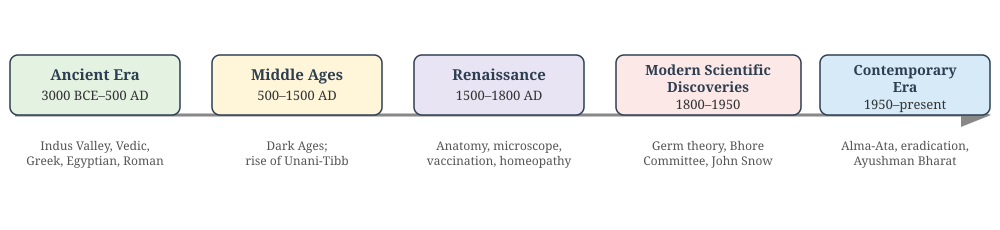
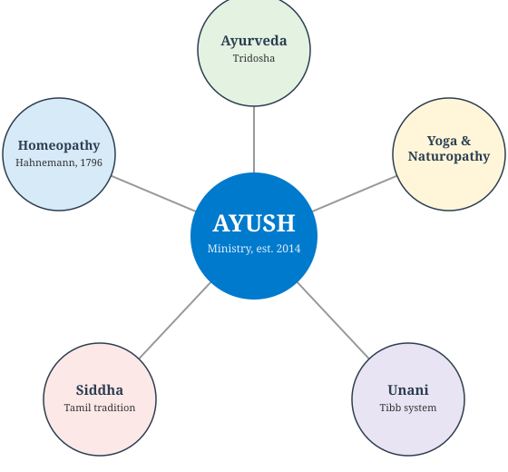
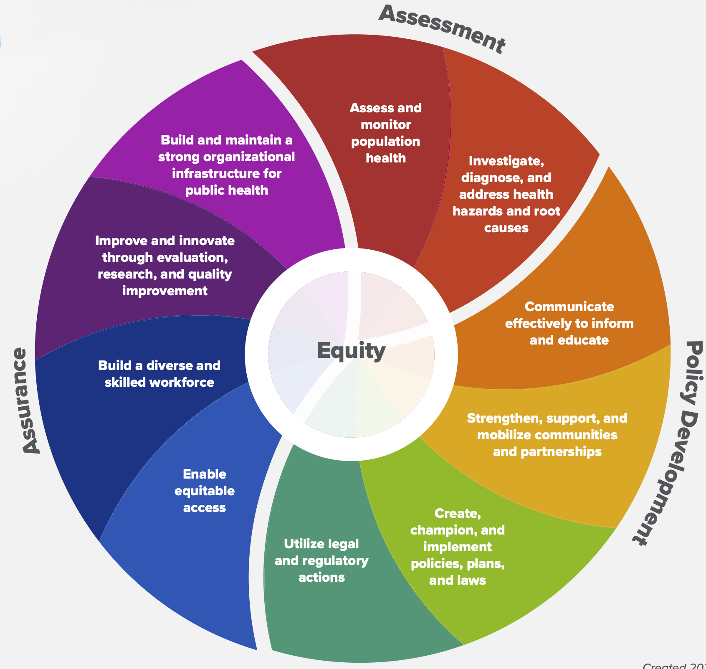
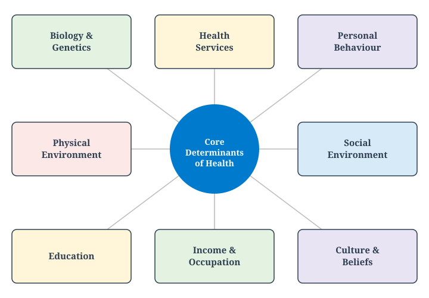
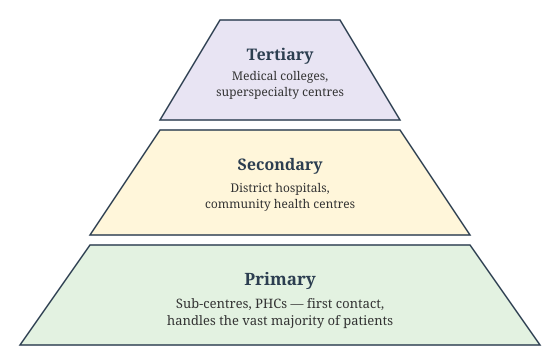
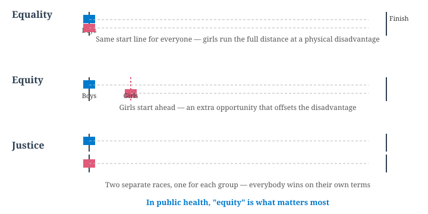

## Welcome {#home}

### Man and Medicine: Towards Health for All

**Learning Objectives:**

- Community medicine, Preventive medicine, social medicine and family medicine
- Define health and describe its dimensions and the health–disease spectrum
- Explain the major determinants of health using an accepted health-field model
- State the Alma-Ata Declaration's definition of Primary Health Care and its goal
- Trace the evolution of medicine from curative to community medicine
- Describe the Bhore Committee's role in shaping India's health system
- Locate "Health for All" within the later MDG → SDG trajectory

**How to read this deck:** each slide is tagged and color-coded — 🟢 **MUST KNOW** (core, exam-critical), 🟡 **SHOULD KNOW** (important context), 🟣 **MAY KNOW** (enrichment), and 🧡 **QUESTION** (self-check).

::: notes
This chapter opens the Foundations section. It sets up vocabulary and frameworks — the definition of health, its determinants, and Primary Health Care — that every later chapter in this series assumes.
:::

## Richest of Rich countries cannot afford to keep on building hospitals ignoring the factors leading to increase in diseases and early deaths.

------------------------------------------------------------------------

## Evolution and Scope of Community Medicine {background-color="#E3F2E1"}

🟢 **MUST KNOW**

Community Medicine broadens the scope of medicine from the **individual** to the **community**.  
It integrates **preventive, promotive, curative, and rehabilitative** services through organized efforts.

**Core idea:** Health is achieved not only by treating disease but by improving living conditions, sanitation, nutrition, and education.

------------------------------------------------------------------------

## Hygiene, Preventive, and Social Medicine {background-color="#FFF6DA"}

🟡 **SHOULD KNOW**

| Field | Focus | Example |
|-------|--------|----------|
| **Hygiene** | Personal and environmental cleanliness | Hand‑washing, safe water |
| **Preventive Medicine** | Preventing disease before it occurs | Immunization, screening |
| **Social Medicine** | Studying social causes of disease | Poverty, housing, education |
| **Community Medicine** | Applying all these at population level | National health programs |

**Key link:** Preventive medicine acts at the *individual level*; social medicine acts at the *societal level*; community medicine integrates both.

------------------------------------------------------------------------

## Public Health: Definition and Functions {background-color="#E3F2E1"}

🟢 **MUST KNOW**

> "The science and art of preventing disease, prolonging life, and promoting physical health and efficiency **through organized community efforts** for the sanitation of the environment, the control of community infections, the education of the individual in principles of personal hygiene, the organization of medical and nursing services for early diagnosis and preventive treatment of disease, and the development of social machinery which will ensure every individual a standard of living adequate for the maintenance of health." — **C.E.A. Winslow, 1920**

**Functions:**
- Health promotion through education  
- Disease prevention via immunization  
- Health restoration through medical care  
- Rehabilitation of the handicapped  

**Aim:** Create conditions for good health — aligning with WHO’s 1948 definition.

------------------------------------------------------------------------

## Difference Between Community Medicine, Family Medicine, Preventive Medicine, and Social Medicine {background-color="#E3F2E1"}

🟢 **MUST KNOW**

| Aspect | **Community Medicine** | **Family Medicine** | **Preventive Medicine** | **Social Medicine** |
|--------|------------------------|---------------------|-------------------------|---------------------|
| **Unit of focus** | Community/population | Family & individual across lifespan | Individual risk factors | Society & social determinants |
| **Scope** | Epidemiology, health programs, PHC, public health | Continuity of care, holistic family-centered practice | Immunization, screening, prophylaxis | Links health with social, economic, cultural context |
| **Approach** | Population-based interventions | Person-centered, longitudinal care | Disease prevention before onset | Understanding social causes of disease |
| **Examples** | National immunization program, sanitation drives | Managing diabetes in a family context | Vaccination, health check-ups | Studying impact of poverty on TB outcomes |

------------------------------------------------------------------------

## Preventive vs Social Medicine {background-color="#FFF6DA"}

🟡 **SHOULD KNOW**

- **Preventive Medicine**  
  - Focuses on *stopping disease before it occurs*.  
  - Tools: vaccination, screening, prophylactic drugs, health education.  
  - Example: Polio immunization campaign.  

- **Social Medicine**  
  - Recognizes that *disease has social roots* (poverty, housing, education, occupation).  
  - Tools: policy advocacy, social reforms, addressing inequities.  
  - Example: Improving living conditions to reduce tuberculosis incidence.  

**Key difference:** Preventive medicine acts at the *individual level* to stop disease; social medicine acts at the *societal level* to address causes behind causes.

------------------------------------------------------------------------

## Community Medicine vs Family Medicine {background-color="#FFF6DA"}

🟡 **SHOULD KNOW**

- **Community Medicine**  
  - Concerned with the health of populations.  
  - Uses epidemiology, biostatistics, and health programs.  
  - Example: Designing a malaria control program for a district.  

- **Family Medicine**  
  - Concerned with the health of individuals *within the family unit*.  
  - Provides continuous, comprehensive, and holistic care.  
  - Example: Managing hypertension, diabetes, and mental health in one family across generations.  

**Key difference:** Community medicine is *population-focused*, family medicine is *person-focused but within family context*.

------------------------------------------------------------------------

## Community Diagnosis {background-color="#FFF6DA"}

🟡 **SHOULD KNOW**

| Aspect | Clinical Diagnosis | Community Diagnosis |
|--------|---------------------|----------------------|
| Made by | Doctor | Epidemiologist |
| Concerned with | Individual | Defined population |
| Scope | Only sick | Both sick and healthy |
| Purpose | Decide treatment | Plan prevention and promotion |
| Follow-up | Case | Program |

**Stages:** Data collection and analysis → Interpretation → Dissemination → Action

**Relevance:** Identifies community health problems, sets priorities, and guides interventions.

------------------------------------------------------------------------

## Community Diagnosis: Steps and Parameters {background-color="#FFF6DA"}

🟡 **SHOULD KNOW**

**How a community diagnosis is made** (same logic as diagnosing a
patient — history, examination, tests — applied to a population):

1. Collect socio-demographic data (age, sex, education, occupation, income)
2. Collect environmental data (housing, water, sanitation)
3. Identify mortality/morbidity causes and risk factors
4. Distinguish **professionally identified needs** from **felt needs**
5. Write the findings as a short "community diagnosis" statement, then plan **community treatment**

**Parameters used to assess a health service** for that community:
*Relevance, Adequacy, Accessibility, Availability, Affordability, Completeness.*

------------------------------------------------------------------------

## Community vs Hospital Medicine {background-color="#FFF6DA"}

🟡 **SHOULD KNOW**

| Aspect | Community Medicine | Hospital Medicine |
|--------|---------------------|---------------------|
| Service area | Defined population | Ill-defined catchment |
| Approach | Active outreach | Passive, patient-driven |
| Focus | Prevention and promotion | Curative care |
| Coordination | Intersectoral | Limited |
| Cost-benefit | High (population impact) | Individual outcome |

**Principle:** Prevention is safer, cheaper, and easier than cure.

------------------------------------------------------------------------

## Social Anatomy, Physiology, Pathology, and Therapy {background-color="#E8E4F3"}

🟣 **MAY KNOW**

| Concept | Analogy | Example |
|---------|---------|---------|
| Social Anatomy | Structure of society | Social stratification, institutions |
| Social Physiology | Functions of society | Education, communication |
| Social Pathology | Abnormalities | Crime, poverty, delinquency |
| Social Therapy | Treatment | Legislation, reform, welfare services |

------------------------------------------------------------------------

## Five Eras of Medical History {background-color="#FFF6DA"}

🟡 **SHOULD KNOW**

The history of medicine and public health is conventionally divided into five eras:

{.slide-img .nostretch width="780px"}

------------------------------------------------------------------------

## Ancient Era: Indian and World Medicine {background-color="#FFF6DA"}

🟡 **SHOULD KNOW**

- **Indus Valley (3000–1500 BC):** well-planned townships with house drains, public drains, and water-storage tanks — public health thinking existed before it was named
- **Ayurveda:** laid down in the *Atharvaveda*; health = balance of three *doshas* — **Vata** (air), **Pitta** (bile), **Kapha** (phlegm). Key sages: **Atreya** (teacher, 8th–9th c. BCE), **Sushruta** (surgery, *Sushruta Samhita*), **Charaka** (*Charaka Samhita*, medicine and drugs)
- **Greek medicine — Hippocrates** (c. 460–370 BCE), the father of medicine: the Hippocratic Oath; four humors (blood, phlegm, black bile, yellow bile); *On Airs, Waters and Places* — arguably the first work of epidemiology
- **Egyptian:** Imhotep; medical knowledge recorded in *Papyrus* texts (surgery; drugs and pharmacopeia)
- **Roman:** public baths, drainage against malaria, the first census; **Galen** (129–200 AD), leading anatomist, whose theories held sway for ~1500 years

------------------------------------------------------------------------

## Middle Ages and the Renaissance {background-color="#E8E4F3"}

🟣 **MAY KNOW**

- **Middle Ages (500–1500 AD)** — the "Dark Ages": wars, famine, and epidemics (the Black Death); little progress in medicine, *except* the rise of the **Arabic/Unani-Tibb system**, blending Greco-Roman ideas — **Avicenna** (*Cannons of Avicenna*) and **Rhazes** (measles) are its most famous physicians
- **Renaissance (1500–1800 AD):**
  - **Paracelsus** — championed evidence over superstition
  - **Vesalius** — systematic human dissection (*Fabrica*)
  - **William Harvey** — circulation of blood; **Leeuwenhoek** (1679) — the microscope
  - **James Lind** (1747) — his citrus-fruit trial against scurvy is widely regarded as the **first scientifically conducted clinical trial** in medical history
  - **Edward Jenner** (1796) — smallpox vaccination
  - **Samuel Hahnemann** (1796) — founded **homeopathy** on "like cures like"
  - **John Graunt** (1662) — numerical analysis of mortality, founder of biostatistics

------------------------------------------------------------------------

## Era of Modern Scientific Discoveries (1800–1950) {background-color="#FFF6DA"}

🟡 **SHOULD KNOW**

**Germ theory and its consequences:** Koch (TB, cholera, anthrax bacilli), Lister (antisepsis), Pasteur (anti-rabies), Hansen (leprosy bacillus) — followed by X-rays (Roentgen, 1897), BCG vaccine (1920), penicillin (Fleming, 1940), streptomycin (1949).

**In India:** the Indian Medical Services; malaria's mode of transmission discovered by **Ronald Ross** (Nobel Prize); the **Bhore Committee** (1946, covered in detail later in this deck); **Dr. Sushila Nayyar** and **Dr. Bidhan Chandra Roy** as pioneers of modern Indian health-care (also covered later).

**In the world:** Edwin Chadwick's UK sanitary report (1842) → first British Public Health Act (1848); Lemuel Shattuck's US public-health reforms; **John Snow's** cholera investigation (covered in detail later in this deck); William Farr (epidemiological surveillance); William Budd (typhoid, water contamination).

------------------------------------------------------------------------

## Indigenous Systems of Medicine: AYUSH {background-color="#FFF6DA"}

🟡 **SHOULD KNOW**

Alongside allopathy, India officially recognizes five indigenous systems of medicine, brought under one umbrella by the **Ministry of AYUSH** (established 2014):

{.slide-img .nostretch width="420px"}

------------------------------------------------------------------------

## Ayurveda, Yoga, and Naturopathy {background-color="#FFF6DA"}

🟡 **SHOULD KNOW**

- **Ayurveda** — laid down in the *Atharvaveda*; health depends on the balance of three *doshas*: **Vata** (air), **Pitta** (bile), **Kapha** (phlegm/mucus); foundational texts include the *Charaka Samhita* and *Sushruta Samhita*
- **Yoga** — a physical, mental, and spiritual discipline used for health promotion, stress management, and disease prevention
- **Naturopathy** — a drug-free system based on the body's own capacity to heal, using diet, water, and lifestyle measures

------------------------------------------------------------------------

## Unani and Siddha {background-color="#E8E4F3"}

🟣 **MAY KNOW**

- **Unani (Unani-Tibb)** — a Greco-Arabic system that reached India via the medieval Arabic system of medicine; based on a humoral theory similar to ancient Greek medicine; its classical authorities include **Avicenna** and **Rhazes**
- **Siddha** — one of the oldest systems of medicine, rooted in Tamil Nadu and associated with the *Siddhars*; shares conceptual ground with Ayurveda but has its own distinct pharmacopeia and texts

------------------------------------------------------------------------

## Homeopathy {background-color="#E8E4F3"}

🟣 **MAY KNOW**

- Founded by **Samuel Hahnemann** in **1796**, in Germany
- Core doctrine: *"like cures like"* — a substance that causes symptoms in a healthy person can, in a highly diluted form, treat similar symptoms in a sick person
- Widely practiced in India as one of the recognized AYUSH systems

------------------------------------------------------------------------

## AYUSH in Public Health: Role and Limitations {background-color="#FFF6DA"}

🟡 **SHOULD KNOW**

**Where AYUSH fits well:** wellness and preventive health services, lifestyle counseling, and supportive/complementary care in select chronic conditions — **not** as a substitute for intensive care, surgery, or emergency resuscitation.

**Key limitations:**
- Standardization and quality control of herbal/traditional preparations
- Safety and drug-interaction data are often incomplete
- Evidence base is uneven across the different systems
- "Natural" does **not** automatically mean "safe" — natural substances can still be toxic or interact with other medicines

------------------------------------------------------------------------

## Essential Public health services {background-color="#E8E4F3"}

🟢 **MUST KNOW**

::::: columns
::: {.column width="70%"}
{.slide-img height="420px"}
:::

::: {.column width="30%"}
1. Monitor health  
2. Diagnose and investigate  
3. Inform, educate, empower  
4. Mobilize community partnerships  
5. Develop policies  
6. Enforce laws  
7. Link to/provide care  
8. Assure competent workforce  
9. Evaluate  
10. Research for new insights
:::
:::::

------------------------------------------------------------------------

## What Is Health? {background-color="#E3F2E1"}

🟢 **MUST KNOW**

**WHO Constitution (1948):**

> "Health is a state of complete physical, mental and social well-being and not merely the absence of disease or infirmity."

This definition has never been formally amended. Two things make it radical for its time:

- It rejects the purely **biomedical** view (health = absence of disease)
- It names **three dimensions at once** — physical, mental, social — as jointly necessary

::: notes
Drafted at the International Health Conference, New York, 1946; the WHO Constitution entered into force on 7 April 1948 (now marked annually as World Health Day).
:::

------------------------------------------------------------------------

## Dimensions of Health {background-color="#E3F2E1"}

🟢 **MUST KNOW**

::::: columns
::: {.column width="50%"}
**Commonly taught dimensions:**

- **Physical** — normal structure and function of the body
- **Mental** — a state of balance with oneself and one's environment
- **Social** — harmony with the social fabric: family, community, work
- **Spiritual** — a sense of purpose, values, or belief
- **Emotional** — the ability to recognize and appropriately express feelings
:::

::: {.column width="50%"}
**Why this matters:**

A person can be free of diagnosable disease and still not be "healthy" by this definition — e.g. someone who is physically fit but socially isolated or under chronic mental distress.
:::
:::::

------------------------------------------------------------------------

## The Health–Disease Spectrum {background-color="#E3F2E1"}

🟢 **MUST KNOW**

Health is not a fixed state but a **continuum**, moving in both directions:

`Death → Chronic illness → Disability → Mild sickness → No obvious illness → Positive health`

- **Positive health** is more than "not sick" — it implies resilience and a reserve capacity to cope with physical, biological, and social stress
- Any individual can move along this spectrum over time; public health aims to shift populations **toward** the positive-health end, not just treat people once they've crossed into illness

------------------------------------------------------------------------

## Determinants of Health {background-color="#E3F2E1"}

🟢 **MUST KNOW**

A widely used health-field model groups the determinants of health into four domains:

| Domain | Examples |
|------------------------------------|------------------------------------|
| **Environment** | safe water, sanitation, housing, air quality, occupational hazards |
| **Heredity / Biology** | genetic makeup, age, sex, inherited susceptibility to disease |
| **Lifestyle / Behaviour** | diet, physical activity, tobacco/alcohol use, personal hygiene |
| **Health services** | access, affordability, and quality of preventive and curative care |

**Key implication:** health care services are only *one* of four determinants — and historically not the largest one. Improving population health depends at least as much on environment, behaviour, and social conditions as on hospitals and doctors.

::: notes
This is the Blum / Lalonde-style "health field concept," standard across Indian community-medicine teaching. Different sources add socio-economic and political factors as a fifth domain — mention this as a natural extension in discussion, not a contradiction.
:::

------------------------------------------------------------------------

## Determinants of Health: A Wider View {background-color="#E8E4F3"}

🟣 **MAY KNOW**

The four-domain model on the previous slide is the core teaching; textbooks also break determinants into a wider set of interacting domains:

{.slide-img .nostretch width="480px"}

------------------------------------------------------------------------

## Primary Health Care: Alma-Ata, 1978 {background-color="#E3F2E1"}

🟢 **MUST KNOW**

At Alma-Ata (in present-day Kazakhstan), 134 WHO member states and 67 organisations adopted a declaration defining Primary Health Care (PHC):

> "Essential health care based on practical, scientifically sound and socially acceptable methods and technology, made universally accessible to individuals and families... through their full participation and at a cost the community and country can afford... the first level of contact of individuals, the family and community with the national health system."

**The goal it set:** *"Health for All by the year 2000"* — a level of health that would let all people lead a socially and economically productive life, with PHC declared the key strategy to reach it.

------------------------------------------------------------------------

## Levels of Healthcare: Primary, Secondary, Tertiary {background-color="#E3F2E1"}

🟢 **MUST KNOW**

Health-care is delivered through a graded, three-tier system — most needs are met at the base, with progressively fewer patients needing the more specialized tiers above:

{.slide-img .nostretch width="440px"}

------------------------------------------------------------------------

## Principles of Primary Health Care {background-color="#E3F2E1"}

🟢 **MUST KNOW**

- **Equitable distribution** — care reaches rural and underserved populations, not just cities
- **Community participation** — individuals and communities help plan and run their own care, not just receive it
- **Intersectoral coordination** — health links to agriculture, education, housing, water supply, and rural development
- **Appropriate technology** — methods that are scientifically valid, affordable, and acceptable to the community, not merely the most advanced available

------------------------------------------------------------------------

## Equality, Equity, and Justice {background-color="#FFF6DA"}

🟡 **SHOULD KNOW**

These three terms are often confused, but public health cares most about **equity**:

{.slide-img .nostretch width="600px"}

**Example:** Ayushman Bharat gives free secondary/tertiary care specifically to the poorest households — the whole population has access to care, but the most disadvantaged get an extra opportunity. That is equity, not mere equality.

------------------------------------------------------------------------

## Evolution of Medicine {background-color="#FFF6DA"}

🟡 **SHOULD KNOW**

Medicine's scope has widened in stages:

1.  **Curative medicine** — treating disease in the individual patient
2.  **Preventive medicine** — stopping disease before it starts (e.g. immunization, screening)
3.  **Social medicine** — recognizing that disease has social causes and consequences, not only biological ones
4.  **Community medicine / Public health** — shifting the unit of concern from the individual patient to the **community** as a whole

Each stage didn't replace the one before it — modern health systems practice all four simultaneously, for different needs.

------------------------------------------------------------------------

## The Bhore Committee (1946) {background-color="#FFF6DA"}

🟡 **SHOULD KNOW**

The Health Survey and Development Committee, chaired by **Sir Joseph Bhore**, was appointed by the colonial government in 1943 and reported in 1946. It remains the foundational blueprint for independent India's health system.

**Key recommendations:**

- Integrate **preventive and curative services** at every administrative level, instead of running them separately
- Establish **Primary Health Centres** — short-term target of one PHC per 40,000 population
- Strengthen **maternal and child health** services
- Reorient medical education toward training "**social physicians**" — doctors trained in preventive and social medicine, not curative care alone
- Raise health spending to at least **15% of government expenditure**

Many of these ideas — the PHC network, integration of services — are still the structural basis of India's public health system today.

------------------------------------------------------------------------

## Pioneers of Modern Indian Public Health {background-color="#E8E4F3"}

🟣 **MAY KNOW**

Alongside Sir Joseph Bhore, two other figures shaped modern Indian health-care:

- **Dr. Sushila Nayyar** — founded a small dispensary at Sewagram (Wardha) in 1944 that grew into the Mahatma Gandhi Institute of Medical Sciences, known for its focus on holistic rural health-care; later became India's second Union Health Minister
- **Dr. Bidhan Chandra Roy** — first doctor to become Chief Minister of an Indian state (West Bengal); his birthday, 1 July, is celebrated nationally as **"Doctors' Day"**

------------------------------------------------------------------------

## From Health for All to the SDGs {background-color="#FFF6DA"}

🟡 **SHOULD KNOW**

"Health for All by 2000" was not fully achieved by its target year, but it set a template that later global goals built on:

- **2000–2015:** Millennium Development Goals (MDGs) — several goals (child mortality, maternal health, HIV/malaria/TB) were direct descendants of the Health for All agenda
- **2015–2030:** Sustainable Development Goals (SDGs) — health consolidated under **SDG 3: Good Health and Well-being**, with Universal Health Coverage (UHC) as an explicit target

*(The MDG → SDG transition is covered in depth in [Millennium Development Goals to SDGs](../programs/mdg-sdg.qmd); this slide only places it on the timeline.)*

------------------------------------------------------------------------

## Health for All: The 21st-Century Targets {background-color="#E8E4F3"}

🟣 **MAY KNOW**

In 1998, WHO adopted 10 concrete global targets to pursue Health for All in the new century. A few of the most exam-relevant:

- **Survival:** maternal mortality <100/100,000 live births; under-5 mortality <45/1000 live births; life expectancy >70 years
- **Reversal of five major pandemics:** TB, HIV/AIDS, malaria, tobacco-related disease, violence/trauma
- **Eradication/elimination of specific diseases:** measles and lymphatic filariasis (eradication); leprosy and trachoma (elimination)
- **Improved access** to water, sanitation, food, and shelter

------------------------------------------------------------------------

## India's National Health Policy Milestones {background-color="#FFF6DA"}

🟡 **SHOULD KNOW**

- **NHP 1983** — first National Health Policy; reaffirmed Health for All through a PHC-centred approach
- **NHP 2002** — revised targets in light of slower-than-planned progress; emphasized decentralization and public–private partnership
- **NHP 2017** — shifted emphasis toward Universal Health Coverage, preventive and promotive care, and raising public health spending as a share of GDP

------------------------------------------------------------------------

## John Snow: Father of Epidemiology {background-color="#E8E4F3"}

🟣 **MAY KNOW**

::::: columns
::: {.column width="30%"}
{.slide-img .nostretch width="180px"}
:::

::: {.column width="70%"}
- English physician who traced London's 1854 cholera outbreak in Soho to a single contaminated water source
- Plotted cases on a **spot map** centred on the **Broad Street pump**, showing deaths clustering around it
- Convinced local authorities to remove the pump handle, ending the outbreak — decades before germ theory explained *why* it worked
- Showed that disease could be tracked and controlled through **systematic observation and mapping**, not just laboratory science
- Widely regarded as the founding figure of modern epidemiology and disease mapping
- **Lesser-known fact:** by profession he was also a pioneering **anesthesiologist**, who administered chloroform to Queen Victoria during childbirth
:::
:::::

------------------------------------------------------------------------

## Contemporary Era: 1950 to the Present {background-color="#FFF6DA"}

🟡 **SHOULD KNOW**

- **1949–1950:** the Framingham cohort study (heart disease risk factors); Doll and Hill's case-control studies (smoking and lung cancer) — landmark study designs
- **1978:** the **Alma-Ata Declaration** (covered in detail later in this deck)
- **1980:** smallpox declared eradicated worldwide — the first disease ever eradicated
- Continuing challenges: **HIV/AIDS** emerged soon after; recurring outbreaks (SARS, H1N1, Nipah); **COVID-19** (2019–) — the largest global public-health event of this era
- **In India:** community development programme (1952); world's first national family planning programme (1953); last case of smallpox (1975) and of wild polio (2011); National Rural Health Mission (2005); Ayushman Bharat (2018)

------------------------------------------------------------------------

## Public Health Success and Failure Stories {background-color="#E8E4F3"}

🟣 **MAY KNOW**

**Successes** — smallpox and polio eradication, leprosy control, and HIV/AIDS control all shared the same ingredients: strong political will, effective surveillance, community education, an effective intervention (vaccine/drug), and international cooperation.

**A cautionary failure — malaria:** incidence fell from 75 million cases/year (1947) to just 0.1 million (1965) — then resurged to over 6 million/year by 1976. Why: surveillance was relaxed once cases looked "eradicated," over-reliance on a single tool (DDT spraying), and low investment once the disease seemed under control.

**Lesson:** a falling case count is a reason to sustain surveillance, not relax it.

------------------------------------------------------------------------

## The Social Gradient of Health {background-color="#E8E4F3"}

🟣 **MAY KNOW**

Health outcomes follow a **gradient** across socioeconomic position, not just a gap between "poor" and "rich": at every step up the social ladder, average health tends to improve. This is associated with the work of **Michael Marmot** and the WHO Commission on Social Determinants of Health.

**Implication:** improving population health requires acting on the "causes of the causes" — income, education, working conditions — not only on medical risk factors.

------------------------------------------------------------------------

## WHO: A Brief Note on Structure {background-color="#E8E4F3"}

🟣 **MAY KNOW**

- Founded 1948, headquartered in Geneva, Switzerland
- Governed by the **World Health Assembly** (all member states), which sets policy and elects the Director-General
- Operates through **six regional offices** (India falls under WHO-SEARO, the South-East Asia Regional Office)

------------------------------------------------------------------------

## Practice Questions: Descriptive {background-color="#FFF6DA"}

**For written practice — work through these on paper; no auto-check for this slide.**

**Chapter 1 — Introduction to Community Medicine**

1. Define Community Medicine. Discuss its scope and how it differs from clinical/hospital medicine.
2. Differentiate between Hygiene, Preventive Medicine, Social Medicine, and Community Medicine.
3. Describe the steps involved in community diagnosis, along with the parameters used to assess a health programme.
4. Discuss the WHO's definition of public health and its core functions.
5. Write short notes on: (a) Social anatomy, physiology, pathology, and therapy of a community (b) Community Medicine vs Family Medicine.

**Chapter 2 — Indigenous Systems of Medicine (AYUSH)**

6. Describe the AYUSH systems of medicine in India and discuss their role and limitations in public health.
7. Write short notes on: (a) Tridosha theory of Ayurveda (b) The fundamental principle of Homeopathy (c) Unani and Siddha systems of medicine.
8. Discuss how AYUSH systems can be integrated into primary health care, with examples.

------------------------------------------------------------------------

## Self-Check: Question 1 {background-color="#FDE8E8"}

🧡 **QUESTION**

::: quiz-question
### Question 1

According to the WHO Constitution, health is a state of complete physical, mental, and social well-being and:

- A state achieved only after recovering from an illness
- [Not merely the absence of disease or infirmity]{.correct data-explanation="This is the exact WHO Constitution (1948) wording — health is defined positively, not just as the absence of disease."}
- The same as having access to good hospitals
- A purely subjective, unmeasurable feeling
:::

------------------------------------------------------------------------

## Self-Check: Question 2 {background-color="#FDE8E8"}

🧡 **QUESTION**

::: quiz-question
### Question 2

In the health-field / determinants-of-health model used in this chapter, which of the following is **one of the four** domains?

- Political ideology
- [Heredity / biology]{.correct data-explanation="The four domains are environment, heredity/biology, lifestyle, and health services."}
- Climate change policy
- International trade
:::

------------------------------------------------------------------------

## Self-Check: Question 3 {background-color="#FDE8E8"}

🧡 **QUESTION**

::: quiz-question
### Question 3

The Alma-Ata Declaration (1978) set which goal?

- Eradication of all communicable disease by 1990
- [Health for All by the year 2000, through Primary Health Care]{.correct data-explanation="Alma-Ata declared PHC the key strategy to achieve a level of health permitting all people a socially and economically productive life, by the year 2000."}
- Universal vaccination coverage by 1985
- A single global health insurance scheme
:::

------------------------------------------------------------------------

## Self-Check: Question 4 {background-color="#FDE8E8"}

🧡 **QUESTION**

::: quiz-question
### Question 4

Which principle of Primary Health Care specifically refers to health linking with sectors like agriculture, education, and water supply?

- Appropriate technology
- Equitable distribution
- [Intersectoral coordination]{.correct data-explanation="Intersectoral coordination is the PHC principle recognizing that health outcomes depend on sectors beyond healthcare itself."}
- Community participation
:::

------------------------------------------------------------------------

## Self-Check: Question 5 {background-color="#FDE8E8"}

🧡 **QUESTION**

::: quiz-question
### Question 5

The Bhore Committee (1946) recommended a short-term target of one Primary Health Centre per how many population?

- 10,000
- [40,000]{.correct data-explanation="The Bhore Committee's short-term recommendation was one Primary Health Centre per 40,000 population."}
- 100,000
- 500,000
:::

------------------------------------------------------------------------

## Self-Check: Question 6 {background-color="#FDE8E8"}

🧡 **QUESTION**

::: quiz-question
### Question 6

Which stage in the evolution of medicine shifts the unit of concern from the individual patient to the community as a whole?

- Curative medicine
- Preventive medicine
- Social medicine
- [Community medicine / Public health]{.correct data-explanation="Community medicine explicitly treats the community, not the individual patient, as the unit of concern."}
:::

------------------------------------------------------------------------

## Self-Check: Question 7 {background-color="#FDE8E8"}

🧡 **QUESTION**

::: quiz-question
### Question 7

Under the Sustainable Development Goals, health is primarily consolidated under which goal?

- SDG 1 (No Poverty)
- [SDG 3 (Good Health and Well-being)]{.correct data-explanation="SDG 3 is dedicated to health and well-being, including Universal Health Coverage as an explicit target."}
- SDG 6 (Clean Water and Sanitation)
- SDG 13 (Climate Action)
:::

------------------------------------------------------------------------

## Self-Check: Question 8 {background-color="#FDE8E8"}

🧡 **QUESTION**

::: quiz-question
### Question 8

Community medicine primarily differs from clinical medicine in that it focuses on:

- Individual patient care
- Hospital-based management
- [Health of populations]{.correct data-explanation="Clinical medicine focuses on the individual patient; community medicine's unit of concern is the population."}
- Curative services only
:::

------------------------------------------------------------------------

## Self-Check: Question 9 {background-color="#FDE8E8"}

🧡 **QUESTION**

::: quiz-question
### Question 9

Which of the following best reflects the scope of community medicine?

- Diagnosis and treatment
- Rehabilitation only
- [Prevention, promotion, and protection of health]{.correct data-explanation="Community medicine's scope spans prevention, promotion, and protection of health at the population level — not just diagnosis, treatment, or rehabilitation alone."}
- Emergency care
:::

------------------------------------------------------------------------

## Self-Check: Question 10 {background-color="#FDE8E8"}

🧡 **QUESTION**

::: quiz-question
### Question 10

The traditional concept of "Tridosha" — Vata, Pitta, and Kapha — is associated with which system of medicine?

- Unani
- Siddha
- [Ayurveda]{.correct data-explanation="Tridosha (Vata, Pitta, Kapha) is the foundational concept of Ayurveda, laid down in the Atharvaveda."}
- Homeopathy
:::

------------------------------------------------------------------------

## Self-Check: Question 11 {background-color="#FDE8E8"}

🧡 **QUESTION**

::: quiz-question
### Question 11

"Like cures like" is the fundamental principle of:

- Unani
- Yoga
- Siddha
- [Homeopathy]{.correct data-explanation="Homeopathy, founded by Samuel Hahnemann in 1796, is built on the doctrine that a substance causing symptoms in a healthy person can treat similar symptoms in a diluted form."}
:::

------------------------------------------------------------------------

## Self-Check: Question 12 {background-color="#FDE8E8"}

🧡 **QUESTION**

::: quiz-question
### Question 12

A patient develops liver toxicity after taking an unlabeled herbal preparation of unclear dosage. This best illustrates which limitation of AYUSH systems?

- Lack of trained practitioners
- Absence of preventive potential
- [Issues of standardization and safety]{.correct data-explanation="Inconsistent labeling, dosage, and quality control are among AYUSH's most cited real-world limitations — natural origin does not guarantee safety."}
- Ineffectiveness in chronic diseases
:::

------------------------------------------------------------------------

## Self-Check: Question 13 {background-color="#FDE8E8"}

🧡 **QUESTION**

::: quiz-question
### Question 13

Which of the following was the first ever scientifically conducted clinical trial in medical history?

- [Trial of citrus fruits by Lind for preventing scurvy]{.correct data-explanation="James Lind's 1747 citrus-fruit trial against scurvy is widely regarded as the first controlled clinical trial in medical history."}
- Experiment on variolation by Jenner
- Trial of streptomycin for tuberculosis
- Trial of the BCG vaccine
:::

------------------------------------------------------------------------

## Self-Check: Question 14 {background-color="#FDE8E8"}

🧡 **QUESTION**

::: quiz-question
### Question 14

Who is given the title "Founder of Biostatistics"?

- Hippocrates
- Paracelsus
- [Graunt]{.correct data-explanation="John Graunt (1662) pioneered numerical analysis of mortality data and is regarded as the founder of biostatistics."}
- Farr
:::

------------------------------------------------------------------------

## Self-Check: Question 15 {background-color="#FDE8E8"}

🧡 **QUESTION**

::: quiz-question
### Question 15

In India, "Doctors' Day" is celebrated to commemorate the memory of:

- Dr Sushila Nayyar
- [Dr B C Roy]{.correct data-explanation="1 July, Dr Bidhan Chandra Roy's birthday, is celebrated nationally as Doctors' Day."}
- Sir Joseph Bhore
- Dr A L Mudaliar
:::

------------------------------------------------------------------------

## Self-Check: Question 16 {background-color="#FDE8E8"}

🧡 **QUESTION**

::: quiz-question
### Question 16

The term "Community Medicine" places its central emphasis on:

- Diagnosis and treatment of individual patients
- [The community/population as the unit of care, not the individual]{.correct data-explanation="Community Medicine shifts the unit of concern from the individual patient to the community/population as a whole."}
- Advanced laboratory investigations
- Hospital bed-occupancy management
:::

------------------------------------------------------------------------

## Self-Check: Question 17 {background-color="#FDE8E8"}

🧡 **QUESTION**

::: quiz-question
### Question 17

A district health officer, on noticing a cluster of diarrhoeal cases in a village, organizes house-to-house surveys, tests drinking-water sources, and conducts health education sessions. This set of activities best illustrates:

- Clinical case management
- [Applied community medicine practice in the field]{.correct data-explanation="Investigating a cluster at the population level with surveys, environmental testing, and health education is community medicine practice in action."}
- Hospital infection control
- Individual patient counselling
:::

------------------------------------------------------------------------

## Self-Check: Question 18 {background-color="#FDE8E8"}

🧡 **QUESTION**

::: quiz-question
### Question 18

Before planning any intervention, medical students conduct a village health survey to identify the prevailing health problems and locally available resources. This activity is an example of:

- A clinical audit
- [Community diagnosis]{.correct data-explanation="Community diagnosis is precisely this: an organized survey of a community to identify its health problems and available resources before planning action."}
- A case-control study
- A hospital needs-assessment
:::

------------------------------------------------------------------------

## Self-Check: Question 19 {background-color="#FDE8E8"}

🧡 **QUESTION**

::: quiz-question
### Question 19

The primary purpose of field visits during the Community Medicine posting is to:

- Fulfil attendance requirements only
- [Study health problems and services in their real community setting]{.correct data-explanation="Field visits let students see community health problems, determinants, and services first-hand, beyond what is taught in the classroom."}
- Practice surgical procedures
- Conduct hospital ward rounds
:::

------------------------------------------------------------------------

## Self-Check: Question 20 {background-color="#FDE8E8"}

🧡 **QUESTION**

::: quiz-question
### Question 20

Community Medicine contributes most directly to national health development by:

- Running private specialty clinics
- [Planning, implementing, and evaluating public health programmes]{.correct data-explanation="Community Medicine specialists are centrally involved in designing, delivering, and evaluating the public health programmes that drive national health development."}
- Publishing case reports only
- Training only surgical residents
:::

------------------------------------------------------------------------

## Self-Check: Question 21 {background-color="#FDE8E8"}

🧡 **QUESTION (select ALL that apply)**

::: {.quiz-question .quiz-multiple}
### Question 21

Which of the following are recognized functions of Community Medicine?

- [Prevention and control of disease in populations]{.correct}
- Marketing pharmaceutical products
- [Promotion of health through education and intersectoral action]{.correct}
- Maximizing hospital revenue
:::

------------------------------------------------------------------------

## Self-Check: Question 22 {background-color="#FDE8E8"}

🧡 **QUESTION (select ALL that apply)**

::: {.quiz-question .quiz-multiple}
### Question 22

Community Medicine integrates knowledge and methods from which of the following disciplines?

- [Epidemiology and biostatistics]{.correct}
- [Social and behavioural sciences]{.correct}
- Corporate financial accounting
- Automotive engineering
:::

------------------------------------------------------------------------

## Self-Check: Question 23 {background-color="#FDE8E8"}

🧡 **QUESTION**

::: quiz-question
### Question 23

**Assertion (A):** Community Medicine serves as a bridge between clinical medicine and the social sciences.

**Reason (R):** The WHO was founded in 1948 with its headquarters in Geneva.

- A is true, R is false
- A is false, R is true
- [Both A and R are true, but R is NOT the correct explanation of A]{.correct data-explanation="Both statements are independently true, but the founding date and location of WHO has nothing to do with explaining why Community Medicine bridges clinical medicine and social sciences."}
- Both A and R are false
:::

------------------------------------------------------------------------

## Self-Check: Question 24 {background-color="#FDE8E8"}

🧡 **QUESTION**

::: quiz-question
### Question 24

A corporate wellness programme uses regular yoga and meditation sessions to reduce employee stress and improve mental well-being. This approach is best classified under which AYUSH system?

- Unani
- Siddha
- [Yoga and Naturopathy]{.correct data-explanation="Structured yoga/meditation-based wellness and stress-reduction programmes fall under the Yoga and Naturopathy component of AYUSH."}
- Homeopathy
:::

------------------------------------------------------------------------

## Self-Check: Question 25 {background-color="#FDE8E8"}

🧡 **QUESTION**

::: quiz-question
### Question 25

A rural primary health centre incorporates Ayurvedic physicians to manage chronic, non-emergency conditions alongside allopathic care. This reflects which model of health-care delivery?

- Exclusive allopathic model
- [An integrative AYUSH–allopathy model at the primary care level]{.correct data-explanation="Co-locating AYUSH practitioners with allopathic care at PHCs is India's integrative model, formally supported under the National AYUSH Mission."}
- Tertiary referral model
- Purely preventive model with no curative component
:::

------------------------------------------------------------------------

## Self-Check: Question 26 {background-color="#FDE8E8"}

🧡 **QUESTION**

::: quiz-question
### Question 26

AYUSH systems of medicine are, in general, most appropriately used for:

- Emergency trauma surgery
- Acute, life-threatening infections requiring intensive care
- [Chronic conditions, wellness promotion, and preventive care]{.correct data-explanation="AYUSH systems are best suited to chronic disease management, promotive/preventive care, and wellness — not emergency or critical care."}
- Organ transplantation
:::

------------------------------------------------------------------------

## Self-Check: Question 27 {background-color="#FDE8E8"}

🧡 **QUESTION**

::: quiz-question
### Question 27

Which of the following best describes the primary public-health role of AYUSH systems today?

- Replacing allopathic emergency medicine entirely
- [Complementing allopathy through wellness, prevention, and chronic-care support]{.correct data-explanation="AYUSH's recognized public-health role is complementary — supporting wellness, prevention, and chronic-disease care alongside, not instead of, allopathic medicine."}
- Providing the sole basis for national immunization programmes
- Serving only as a historical/cultural reference with no active clinical role
:::

------------------------------------------------------------------------

## Self-Check: Question 28 {background-color="#FDE8E8"}

🧡 **QUESTION (select ALL that apply)**

::: {.quiz-question .quiz-multiple}
### Question 28

Which of the following are potential public-health contributions of AYUSH systems?

- [Low-cost, accessible chronic-disease and wellness care]{.correct}
- [Promotion of healthy lifestyle practices — yoga, diet, daily regimen]{.correct}
- Definitive management of major trauma
- Replacement of vaccination programmes
:::

------------------------------------------------------------------------

## Self-Check: Question 29 {background-color="#FDE8E8"}

🧡 **QUESTION**

::: quiz-question
### Question 29

**Assertion (A):** Integrating AYUSH practitioners into the primary health-care workforce can improve access to care in underserved areas.

**Reason (R):** India has a large trained AYUSH workforce that can be deployed to supplement allopathic human resources for health.

- [Both A and R are true, and R is the correct explanation of A]{.correct data-explanation="India's large AYUSH workforce genuinely can be — and has been — deployed to extend primary care reach, directly explaining the assertion."}
- Both A and R are true, but R is not the correct explanation of A
- A is true, R is false
- A is false, R is true
:::

------------------------------------------------------------------------

## Self-Check: Question 30 {background-color="#FDE8E8"}

🧡 **QUESTION**

::: quiz-question
### Question 30

**Assertion (A):** All AYUSH medicines are inherently safe because they are derived from natural sources.

**Reason (R):** Herbal and natural products can still cause toxicity, especially with poor standardization, incorrect dosage, or drug interactions.

- Both A and R are true, and R is the correct explanation of A
- Both A and R are true, but R is not the correct explanation of A
- A is true, R is false
- [A is false, R is true]{.correct data-explanation="It is false that natural origin guarantees safety — herbal/natural products can cause toxicity, especially without standardization; R correctly states this concern."}
:::

------------------------------------------------------------------------

## Self-Check: Question 31 {background-color="#FDE8E8"}

🧡 **QUESTION**

::: quiz-question
### Question 31

The period from approximately 3000 BCE to 500 AD in the history of medicine is generally referred to as the:

- Middle Ages
- Renaissance
- [Ancient Era]{.correct}
- Contemporary Era
:::

------------------------------------------------------------------------

## Self-Check: Question 32 {background-color="#FDE8E8"}

🧡 **QUESTION**

::: quiz-question
### Question 32

According to Ayurveda, the body's functioning is governed by how many fundamental "doshas" (humors)?

- Two
- [Three — Vata, Pitta, and Kapha (Tridosha)]{.correct}
- Four
- Five
:::

------------------------------------------------------------------------

## Self-Check: Question 33 {background-color="#FDE8E8"}

🧡 **QUESTION**

::: quiz-question
### Question 33

Which is the correct chronological sequence of the ancient Indian medical sages?

- Charaka, Sushruta, Atreya
- Sushruta, Charaka, Atreya
- Charaka, Atreya, Sushruta
- [Atreya, Sushruta, Charaka]{.correct}
:::

------------------------------------------------------------------------

## Self-Check: Question 34 {background-color="#FDE8E8"}

🧡 **QUESTION**

::: quiz-question
### Question 34

The "Father of Medicine," Hippocrates, belonged to which ancient civilization?

- Egyptian
- Roman
- [Greek]{.correct}
- Mesopotamian
:::

------------------------------------------------------------------------

## Self-Check: Question 35 {background-color="#FDE8E8"}

🧡 **QUESTION**

::: quiz-question
### Question 35

The classical text *On Airs, Waters, and Places* — one of the earliest works linking environment to disease — was written by:

- [Hippocrates]{.correct}
- Galen
- Charaka
- Avicenna
:::

------------------------------------------------------------------------

## Self-Check: Question 36 {background-color="#FDE8E8"}

🧡 **QUESTION**

::: quiz-question
### Question 36

During the Dark Ages in Europe, medical knowledge was chiefly preserved and advanced by which system of medicine?

- Greek
- Roman
- Egyptian
- [Arabic (Unani-Tibb)]{.correct}
:::

------------------------------------------------------------------------

## Self-Check: Question 37 {background-color="#FDE8E8"}

🧡 **QUESTION**

::: quiz-question
### Question 37

The *Canon of Medicine* (Al-Qanun fi al-Tibb), a foundational text of which system of medicine, was authored by Avicenna (Ibn Sina)?

- [Unani-Tibb]{.correct}
- Ayurveda
- Siddha
- Homeopathy
:::

------------------------------------------------------------------------

## Self-Check: Question 38 {background-color="#FDE8E8"}

🧡 **QUESTION**

::: quiz-question
### Question 38

Edwin Chadwick, whose 1842 report on sanitary conditions catalyzed the modern public-health movement, worked in which country?

- France
- USA
- [United Kingdom]{.correct}
- Germany
:::

------------------------------------------------------------------------

## Self-Check: Question 39 {background-color="#FDE8E8"}

🧡 **QUESTION**

::: quiz-question
### Question 39

Besides his epidemiological work on cholera, John Snow was, by profession, a pioneering:

- Surgeon
- Microbiologist
- Sanitary engineer
- [Anaesthesiologist]{.correct data-explanation="John Snow was also a pioneering anaesthesiologist, who administered chloroform to Queen Victoria during childbirth."}
:::

------------------------------------------------------------------------

## Self-Check: Question 40 {background-color="#FDE8E8"}

🧡 **QUESTION**

::: quiz-question
### Question 40

In British India, the Registration of Births and Deaths Act was enacted in the year:

- 1858
- [1881]{.correct}
- 1901
- 1919
:::

------------------------------------------------------------------------

## Self-Check: Question 41 {background-color="#FDE8E8"}

🧡 **QUESTION**

::: quiz-question
### Question 41

The transfer of sanitary/public-health functions to Indian provincial control was recommended under the:

- Bhore Committee
- Government of India Act, 1935
- [Montague–Chelmsford Reforms (1919)]{.correct}
- Mudaliar Committee
:::

------------------------------------------------------------------------

## Self-Check: Question 42 {background-color="#FDE8E8"}

🧡 **QUESTION**

::: quiz-question
### Question 42

Which committee is regarded as having laid, as early as 1946, the blueprint that would later be echoed internationally by the Alma-Ata Declaration's emphasis on comprehensive, accessible primary care?

- [The Bhore Committee]{.correct}
- The Mudaliar Committee
- The Kartar Singh Committee
- The Shrivastava Committee
:::

------------------------------------------------------------------------

## Self-Check: Question 43 {background-color="#FDE8E8"}

🧡 **QUESTION**

::: quiz-question
### Question 43

Dr Sushila Nayyar is remembered in Indian public health history as:

- India's first woman Union Health Minister
- A physician closely associated with Mahatma Gandhi
- A key figure in India's TB-control efforts
- [All of the above]{.correct}
:::

------------------------------------------------------------------------

## Self-Check: Question 44 {background-color="#FDE8E8"}

🧡 **QUESTION**

::: quiz-question
### Question 44

The world was officially declared free of smallpox by the WHO in the year:

- 1975
- 1977
- [1980]{.correct}
- 1985
:::

------------------------------------------------------------------------

## Self-Check: Question 45 {background-color="#FDE8E8"}

🧡 **QUESTION**

::: quiz-question
### Question 45

India's National Family Planning Programme — among the earliest government-run programmes of its kind in the world — was launched in:

- 1947
- 1951
- [1952]{.correct}
- 1961
:::

------------------------------------------------------------------------

## Self-Check: Question 46 {background-color="#FDE8E8"}

🧡 **QUESTION**

::: quiz-question
### Question 46

India's first National Health Policy was formulated in the year:

- 1978
- [1983]{.correct}
- 1990
- 2000
:::

------------------------------------------------------------------------

## Self-Check: Question 47 {background-color="#FDE8E8"}

🧡 **QUESTION**

::: quiz-question
### Question 47

India recorded its last case of wild poliovirus in January of which year?

- [2011]{.correct}
- 2012
- 2014
- 2009
:::

------------------------------------------------------------------------

## Self-Check: Question 48 {background-color="#FDE8E8"}

🧡 **QUESTION**

::: quiz-question
### Question 48

NITI Aayog, established in 2015, replaced which earlier body?

- National Development Council
- Finance Commission
- Bhore Committee
- [The Planning Commission]{.correct}
:::

------------------------------------------------------------------------

## Self-Check: Question 49 {background-color="#FDE8E8"}

🧡 **QUESTION**

::: quiz-question
### Question 49

The Ayushman Bharat–PM-JAY scheme, launched in 2018, aims to provide health cover to approximately how many beneficiaries?

- 10 crore
- 25 crore
- [50 crore]{.correct}
- 100 crore
:::

------------------------------------------------------------------------

## Self-Check: Question 50 {background-color="#FDE8E8"}

🧡 **QUESTION**

::: quiz-question
### Question 50

The WHO declared COVID-19 a Public Health Emergency of International Concern (PHEIC) on:

- 31 December 2019
- [30 January 2020]{.correct}
- 11 March 2020
- 1 January 2021
:::

------------------------------------------------------------------------

## Self-Check: Question 51 {background-color="#FDE8E8"}

🧡 **QUESTION**

::: quiz-question
### Question 51

Which of the following is **NOT** a valid point of difference between curative and preventive medicine?

- Curative medicine treats existing disease; preventive medicine averts future disease
- [Both curative and preventive medicine are entirely unconcerned with the community]{.correct data-explanation="This statement is false — preventive medicine (and increasingly curative practice) is very much concerned with the community; it is the invalid claim among the options."}
- Curative medicine is individual-oriented; preventive medicine is population-oriented
- Curative medicine acts after disease onset; preventive medicine acts before onset
:::

------------------------------------------------------------------------

## Self-Check: Question 52 {background-color="#FDE8E8"}

🧡 **QUESTION**

::: quiz-question
### Question 52

The physical, mental, and social aspects within the WHO's definition of health are collectively referred to as its:

- Determinants
- Indicators
- [Dimensions (subdomains) of health]{.correct}
- Indices
:::

------------------------------------------------------------------------

## Self-Check: Question 53 {background-color="#FDE8E8"}

🧡 **QUESTION**

::: quiz-question
### Question 53

Many scholars argue that the original WHO definition of health omits a dimension that has since been widely proposed as a fourth component. Which dimension is this?

- Physical
- Mental
- Social
- [Spiritual]{.correct data-explanation="The original WHO definition names only physical, mental, and social well-being; a spiritual dimension has since been widely proposed as a fourth component, though not formally adopted into the Constitution."}
:::

------------------------------------------------------------------------

## Self-Check: Question 54 {background-color="#FDE8E8"}

🧡 **QUESTION**

::: quiz-question
### Question 54

The most widely cited standard definition of Public Health was given by:

- [C.E.A. Winslow]{.correct}
- Hippocrates
- John Snow
- Edwin Chadwick
:::

------------------------------------------------------------------------

## Self-Check: Question 55 {background-color="#FDE8E8"}

🧡 **QUESTION**

::: quiz-question
### Question 55

The Declaration of Alma-Ata, which established Primary Health Care as the key strategy for Health for All, was adopted in:

- 1946
- 1974
- [1978]{.correct}
- 1990
:::

------------------------------------------------------------------------

## Self-Check: Question 56 {background-color="#FDE8E8"}

🧡 **QUESTION**

::: quiz-question
### Question 56

Among the WHO's 21st-century Health-for-All targets, the target for maternal mortality was to reduce it to:

- [Less than 1 per 1,000 live births]{.correct}
- Less than 10 per 1,000 live births
- Less than 50 per 1,000 live births
- Zero, with no numerical target
:::

------------------------------------------------------------------------

## Self-Check: Question 57 {background-color="#FDE8E8"}

🧡 **QUESTION**

::: quiz-question
### Question 57

Which of the following is commonly used as an indicator of health equity within a population?

- Gross Domestic Product
- [Prevalence of childhood stunting]{.correct}
- Number of hospital beds
- Literacy rate of health workers
:::

------------------------------------------------------------------------

## Self-Check: Question 58 {background-color="#FDE8E8"}

🧡 **QUESTION**

::: quiz-question
### Question 58

The deployment of trained Village Health Guides (VHGs) drawn from within the community is best regarded as an example of which pillar of Primary Health Care?

- [Community participation]{.correct}
- Appropriate technology
- Intersectoral coordination
- Equitable distribution
:::

------------------------------------------------------------------------

## Self-Check: Question 59 {background-color="#FDE8E8"}

🧡 **QUESTION**

::: quiz-question
### Question 59

India's health-care delivery system is organized into how many graded tiers/levels?

- Two
- [Three — Primary, Secondary, and Tertiary]{.correct}
- Four
- Five
:::

------------------------------------------------------------------------

## Self-Check: Question 60 {background-color="#FDE8E8"}

🧡 **QUESTION**

::: quiz-question
### Question 60

Which of the following is **NOT** a characteristic of Primary Health Care as defined at Alma-Ata?

- Universal accessibility
- Community participation
- [Priority given to state-of-the-art tertiary hospitals]{.correct data-explanation="PHC explicitly emphasizes essential, accessible, affordable care — not priority to high-tech tertiary hospitals; this is the characteristic that does NOT belong."}
- Use of appropriate, affordable technology
:::

------------------------------------------------------------------------

## Self-Check: Question 61 {background-color="#FDE8E8"}

🧡 **QUESTION**

::: quiz-question
### Question 61

The Millennium Development Goals (MDGs) set targets to be achieved by the year:

- 2010
- [2015]{.correct}
- 2020
- 2030
:::

------------------------------------------------------------------------

## Self-Check: Question 62 {background-color="#FDE8E8"}

🧡 **QUESTION**

::: quiz-question
### Question 62

Of the various strategies proposed to achieve "Health for All," which was identified as the single most essential?

- Vertical disease-control programmes
- Hospital expansion
- [Primary Health Care]{.correct}
- Medical research funding
:::

------------------------------------------------------------------------

## Self-Check: Question 63 {background-color="#FDE8E8"}

🧡 **QUESTION**

::: quiz-question
### Question 63

The Millennium Development Goals were laid down by:

- [The United Nations Organization]{.correct}
- The World Health Organization
- The World Bank
- UNICEF
:::

------------------------------------------------------------------------

## Self-Check: Question 64 {background-color="#FDE8E8"}

🧡 **QUESTION**

::: quiz-question
### Question 64

The Integrated Child Development Services (ICDS) scheme, which combines health, nutrition, and early-education inputs across ministries, exemplifies which principle?

- [Intersectoral coordination]{.correct}
- Appropriate technology
- Equitable distribution
- Community participation
:::

------------------------------------------------------------------------

## Self-Check: Question 65 {background-color="#FDE8E8"}

🧡 **QUESTION**

::: quiz-question
### Question 65

Community participation, intersectoral coordination, appropriate technology, and equitable distribution are together known as the four pillars of:

- The Bhore Committee report
- [Primary Health Care]{.correct}
- The National Health Policy
- The Sustainable Development Goals
:::

------------------------------------------------------------------------

## Self-Check: Question 66 {background-color="#FDE8E8"}

🧡 **QUESTION**

::: quiz-question
### Question 66

World Health Day 2018 was observed with the theme/focus of:

- Malaria elimination
- [Universal Health Coverage]{.correct}
- Mental health
- Climate change and health
:::

------------------------------------------------------------------------

## Self-Check: Question 67 {background-color="#FDE8E8"}

🧡 **QUESTION**

::: quiz-question
### Question 67

The discipline of "Social Medicine" is chiefly associated with the pioneering work of:

- [Alfred Grotjahn]{.correct}
- John Snow
- Edwin Chadwick
- C.E.A. Winslow
:::

------------------------------------------------------------------------

## Self-Check: Question 68 {background-color="#FDE8E8"}

🧡 **QUESTION**

::: quiz-question
### Question 68

A health-care system in which the government funds and provides medical care to all citizens free at the point of use is best described as:

- Community medicine
- Private insurance-based medicine
- [Socialized (state) medicine]{.correct}
- Family medicine
:::

------------------------------------------------------------------------

## Self-Check: Question 69 {background-color="#FDE8E8"}

🧡 **QUESTION**

::: quiz-question
### Question 69

"Appropriate treatment of common diseases and injuries" is one of the:

- Determinants of health
- [Essential elements/components of Primary Health Care]{.correct}
- SDG targets
- Functions of the Bhore Committee
:::

------------------------------------------------------------------------

## Self-Check: Question 70 {background-color="#FDE8E8"}

🧡 **QUESTION**

::: quiz-question
### Question 70

The original Alma-Ata Declaration set the target of "Health for All" to be achieved by the year:

- 1990
- 1995
- [2000]{.correct}
- 2010
:::

------------------------------------------------------------------------

## Self-Check: Application {background-color="#FDE8E8"}

🧡 **QUESTION**

::: quiz-question
### Application

Which of the following best describes Community Medicine?

- Focuses only on hospital-based curative care
- [Integrates preventive, promotive, curative, and rehabilitative care]{.correct data-explanation="Community Medicine applies all aspects of health care — preventive, promotive, curative, and rehabilitative — at the population level through organized efforts."}
- Deals only with sanitation and hygiene
- Concerned solely with family-level care
:::

------------------------------------------------------------------------

## References {background-color="#FFF6DA"}

1.  World Health Organization. *Constitution of the World Health Organization* (1948, in force 7 April 1948).
2.  World Health Organization / UNICEF. *Declaration of Alma-Ata*, International Conference on Primary Health Care, Alma-Ata, USSR, 6–12 September 1978.
3.  Government of India. *Report of the Health Survey and Development Committee* (Bhore Committee), 1946.
4.  Blum, H.L. *Planning for Health: Development and Application of Social Change Theory*. Human Sciences Press, 1974.
5.  Lalonde, M. *A New Perspective on the Health of Canadians*. Government of Canada, 1974.
6.  Marmot, M. & WHO Commission on Social Determinants of Health. *Closing the Gap in a Generation*, 2008.
7.  Ministry of Health & Family Welfare, Government of India. *National Health Policy* 1983, 2002, 2017.
8.  Bhalwar, R. (Ed.) *Text Book of Community Medicine*. Chapters: "Historical Concepts in Community Medicine" and "General Concepts in Health, Community Medicine and Public Health."
9.  Indian Association of Preventive and Social Medicine (IAPSM), Core Committee. *Community Medicine: An Introduction*.
10. Ministry of AYUSH, Government of India. *About the Ministry* — Ayurveda, Yoga & Naturopathy, Unani, Siddha, and Homeopathy.

**Want to practice?** See the companion [Man and Medicine Question Bank](man-and-medicine-question-bank.qmd) for short-answer, MCQ, and assertion–reason questions with an answer key.

------------------------------------------------------------------------

## Thank You!

**Next Chapter:** Concept of Health and Disease

[Top](#home) \| [Contents](../intro.html) \| Chapter 1/29 \| [Next Chapter →](concept-health-disease.html)
