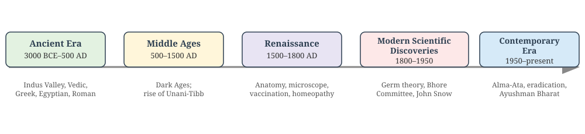
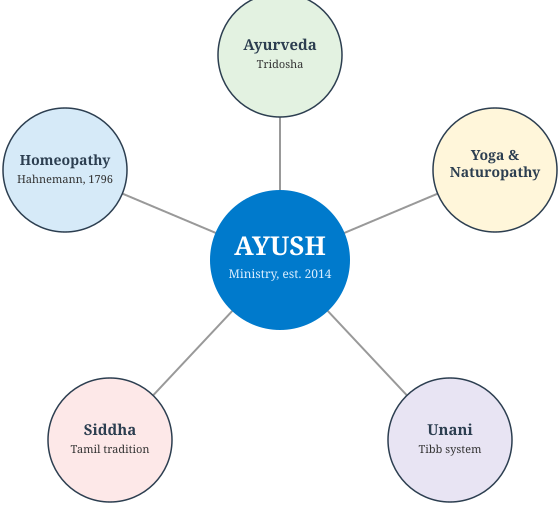

## Welcome {#home}

### Man and Medicine: Towards Health for All

**Learning Objectives:**

- Trace the history of medicine through its major eras, from antiquity to the present
- Describe India's indigenous systems of medicine (AYUSH) and their role in public health
- Describe the Bhore Committee's role in shaping India's health system
- Locate "Health for All" within the later MDG → SDG trajectory
- Identify the pioneers and milestones of modern Indian and global public health

**How to read this deck:** each slide is tagged and color-coded — 🟢 **MUST KNOW** (core, exam-critical), 🟡 **SHOULD KNOW** (important context), 🟣 **MAY KNOW** (enrichment), and 🧡 **QUESTION** (self-check).

::: notes
This chapter opens the Foundations section with the history and identity of medicine as a discipline — its evolution through the major eras, India's indigenous (AYUSH) systems, and the milestones of modern Indian public health. Core concept-of-health material (definitions, dimensions, determinants, Primary Health Care) is taught in depth in the next chapter, [Concept of Health and Disease](concept-health-disease.qmd).
:::

## Richest of Rich countries cannot afford to keep on building hospitals ignoring the factors leading to increase in diseases and early deaths.

------------------------------------------------------------------------

## Five Eras of Medical History {background-color="#FFF6DA"}

🟡 **SHOULD KNOW**

The history of medicine and public health is conventionally divided into five eras:

{.slide-img .nostretch width="780px"}

------------------------------------------------------------------------

## Ancient Era: Indian and World Medicine {background-color="#FFF6DA"}

🟡 **SHOULD KNOW**

- **Indus Valley (3000–1500 BC):** well-planned townships with house drains, public drains, and water-storage tanks — public health thinking existed before it was named
- **Ayurveda:** laid down in the *Atharvaveda*; health = balance of three *doshas* — **Vata** (air), **Pitta** (bile), **Kapha** (phlegm). Key sages: **Atreya** (teacher, 8th–9th c. BCE), **Sushruta** (surgery, *Sushruta Samhita*), **Charaka** (*Charaka Samhita*, medicine and drugs)
- **Greek medicine — Hippocrates** (c. 460–370 BCE), the father of medicine: the Hippocratic Oath; four humors (blood, phlegm, black bile, yellow bile); *On Airs, Waters and Places* — arguably the first work of epidemiology
- **Egyptian:** Imhotep; medical knowledge recorded in *Papyrus* texts (surgery; drugs and pharmacopeia)
- **Roman:** public baths, drainage against malaria, the first census; **Galen** (129–200 AD), leading anatomist, whose theories held sway for ~1500 years

------------------------------------------------------------------------

## Middle Ages and the Renaissance {background-color="#E8E4F3"}

🟣 **MAY KNOW**

- **Middle Ages (500–1500 AD)** — the "Dark Ages": wars, famine, and epidemics (the Black Death); little progress in medicine, *except* the rise of the **Arabic/Unani-Tibb system**, blending Greco-Roman ideas — **Avicenna** (*Cannons of Avicenna*) and **Rhazes** (measles) are its most famous physicians
- **Renaissance (1500–1800 AD):**
  - **Paracelsus** — championed evidence over superstition
  - **Vesalius** — systematic human dissection (*Fabrica*)
  - **William Harvey** — circulation of blood; **Leeuwenhoek** (1679) — the microscope
  - **James Lind** (1747) — his citrus-fruit trial against scurvy is widely regarded as the **first scientifically conducted clinical trial** in medical history
  - **Edward Jenner** (1796) — smallpox vaccination
  - **Samuel Hahnemann** (1796) — founded **homeopathy** on "like cures like"
  - **John Graunt** (1662) — numerical analysis of mortality, founder of biostatistics

------------------------------------------------------------------------

## Era of Modern Scientific Discoveries (1800–1950) {background-color="#FFF6DA"}

🟡 **SHOULD KNOW**

**Germ theory and its consequences:** Koch (TB, cholera, anthrax bacilli), Lister (antisepsis), Pasteur (anti-rabies), Hansen (leprosy bacillus) — followed by X-rays (Roentgen, 1897), BCG vaccine (1920), penicillin (Fleming, 1940), streptomycin (1949).

**In India:** the Indian Medical Services; malaria's mode of transmission discovered by **Ronald Ross** (Nobel Prize); the **Bhore Committee** (1946, covered in detail later in this deck); **Dr. Sushila Nayyar** and **Dr. Bidhan Chandra Roy** as pioneers of modern Indian health-care (also covered later).

**In the world:** Edwin Chadwick's UK sanitary report (1842) → first British Public Health Act (1848); Lemuel Shattuck's US public-health reforms; **John Snow's** cholera investigation (covered in detail later in this deck); William Farr (epidemiological surveillance); William Budd (typhoid, water contamination).

------------------------------------------------------------------------

## Indigenous Systems of Medicine: AYUSH {background-color="#FFF6DA"}

🟡 **SHOULD KNOW**

Alongside allopathy, India officially recognizes five indigenous systems of medicine, brought under one umbrella by the **Ministry of AYUSH** (established 2014):

{.slide-img .nostretch width="420px"}

------------------------------------------------------------------------

## Ayurveda, Yoga, and Naturopathy {background-color="#FFF6DA"}

🟡 **SHOULD KNOW**

- **Ayurveda** — laid down in the *Atharvaveda*; health depends on the balance of three *doshas*: **Vata** (air), **Pitta** (bile), **Kapha** (phlegm/mucus); foundational texts include the *Charaka Samhita* and *Sushruta Samhita*
- **Yoga** — a physical, mental, and spiritual discipline used for health promotion, stress management, and disease prevention
- **Naturopathy** — a drug-free system based on the body's own capacity to heal, using diet, water, and lifestyle measures

------------------------------------------------------------------------

## Unani and Siddha {background-color="#E8E4F3"}

🟣 **MAY KNOW**

- **Unani (Unani-Tibb)** — a Greco-Arabic system that reached India via the medieval Arabic system of medicine; based on a humoral theory similar to ancient Greek medicine; its classical authorities include **Avicenna** and **Rhazes**
- **Siddha** — one of the oldest systems of medicine, rooted in Tamil Nadu and associated with the *Siddhars*; shares conceptual ground with Ayurveda but has its own distinct pharmacopeia and texts

------------------------------------------------------------------------

## Homeopathy {background-color="#E8E4F3"}

🟣 **MAY KNOW**

- Founded by **Samuel Hahnemann** in **1796**, in Germany
- Core doctrine: *"like cures like"* — a substance that causes symptoms in a healthy person can, in a highly diluted form, treat similar symptoms in a sick person
- Widely practiced in India as one of the recognized AYUSH systems

------------------------------------------------------------------------

## AYUSH in Public Health: Role and Limitations {background-color="#FFF6DA"}

🟡 **SHOULD KNOW**

**Where AYUSH fits well:** wellness and preventive health services, lifestyle counseling, and supportive/complementary care in select chronic conditions — **not** as a substitute for intensive care, surgery, or emergency resuscitation.

**Key limitations:**
- Standardization and quality control of herbal/traditional preparations
- Safety and drug-interaction data are often incomplete
- Evidence base is uneven across the different systems
- "Natural" does **not** automatically mean "safe" — natural substances can still be toxic or interact with other medicines

------------------------------------------------------------------------

## The Bhore Committee (1946) {background-color="#FFF6DA"}

🟡 **SHOULD KNOW**

The Health Survey and Development Committee, chaired by **Sir Joseph Bhore**, was appointed by the colonial government in 1943 and reported in 1946. It remains the foundational blueprint for independent India's health system.

**Key recommendations:**

- Integrate **preventive and curative services** at every administrative level, instead of running them separately
- Establish **Primary Health Centres** — short-term target of one PHC per 40,000 population
- Strengthen **maternal and child health** services
- Reorient medical education toward training "**social physicians**" — doctors trained in preventive and social medicine, not curative care alone
- Raise health spending to at least **15% of government expenditure**

Many of these ideas — the PHC network, integration of services — are still the structural basis of India's public health system today.

------------------------------------------------------------------------

## Pioneers of Modern Indian Public Health {background-color="#E8E4F3"}

🟣 **MAY KNOW**

Alongside Sir Joseph Bhore, two other figures shaped modern Indian health-care:

- **Dr. Sushila Nayyar** — founded a small dispensary at Sewagram (Wardha) in 1944 that grew into the Mahatma Gandhi Institute of Medical Sciences, known for its focus on holistic rural health-care; later became India's second Union Health Minister
- **Dr. Bidhan Chandra Roy** — first doctor to become Chief Minister of an Indian state (West Bengal); his birthday, 1 July, is celebrated nationally as **"Doctors' Day"**

------------------------------------------------------------------------

## From Health for All to the SDGs {background-color="#FFF6DA"}

🟡 **SHOULD KNOW**

"Health for All by 2000" was not fully achieved by its target year, but it set a template that later global goals built on:

- **2000–2015:** Millennium Development Goals (MDGs) — several goals (child mortality, maternal health, HIV/malaria/TB) were direct descendants of the Health for All agenda
- **2015–2030:** Sustainable Development Goals (SDGs) — health consolidated under **SDG 3: Good Health and Well-being**, with Universal Health Coverage (UHC) as an explicit target

*(The MDG → SDG transition is covered in depth in [Millennium Development Goals to SDGs](../programs/mdg-sdg.qmd); this slide only places it on the timeline.)*

------------------------------------------------------------------------

## Health for All: The 21st-Century Targets {background-color="#E8E4F3"}

🟣 **MAY KNOW**

In 1998, WHO adopted 10 concrete global targets to pursue Health for All in the new century. A few of the most exam-relevant:

- **Survival:** maternal mortality <100/100,000 live births; under-5 mortality <45/1000 live births; life expectancy >70 years
- **Reversal of five major pandemics:** TB, HIV/AIDS, malaria, tobacco-related disease, violence/trauma
- **Eradication/elimination of specific diseases:** measles and lymphatic filariasis (eradication); leprosy and trachoma (elimination)
- **Improved access** to water, sanitation, food, and shelter

------------------------------------------------------------------------

## India's National Health Policy Milestones {background-color="#FFF6DA"}

🟡 **SHOULD KNOW**

- **NHP 1983** — first National Health Policy; reaffirmed Health for All through a PHC-centred approach
- **NHP 2002** — revised targets in light of slower-than-planned progress; emphasized decentralization and public–private partnership
- **NHP 2017** — shifted emphasis toward Universal Health Coverage, preventive and promotive care, and raising public health spending as a share of GDP

------------------------------------------------------------------------

## John Snow: Father of Epidemiology {background-color="#E8E4F3"}

🟣 **MAY KNOW**

::::: columns
::: {.column width="30%"}
{.slide-img .nostretch width="180px"}
:::

::: {.column width="70%"}
- English physician who traced London's 1854 cholera outbreak in Soho to a single contaminated water source
- Plotted cases on a **spot map** centred on the **Broad Street pump**, showing deaths clustering around it
- Convinced local authorities to remove the pump handle, ending the outbreak — decades before germ theory explained *why* it worked
- Showed that disease could be tracked and controlled through **systematic observation and mapping**, not just laboratory science
- Widely regarded as the founding figure of modern epidemiology and disease mapping
- **Lesser-known fact:** by profession he was also a pioneering **anesthesiologist**, who administered chloroform to Queen Victoria during childbirth
:::
:::::

------------------------------------------------------------------------

## Contemporary Era: 1950 to the Present {background-color="#FFF6DA"}

🟡 **SHOULD KNOW**

- **1949–1950:** the Framingham cohort study (heart disease risk factors); Doll and Hill's case-control studies (smoking and lung cancer) — landmark study designs
- **1978:** the **Alma-Ata Declaration** (covered in detail later in this deck)
- **1980:** smallpox declared eradicated worldwide — the first disease ever eradicated
- Continuing challenges: **HIV/AIDS** emerged soon after; recurring outbreaks (SARS, H1N1, Nipah); **COVID-19** (2019–) — the largest global public-health event of this era
- **In India:** community development programme (1952); world's first national family planning programme (1953); last case of smallpox (1975) and of wild polio (2011); National Rural Health Mission (2005); Ayushman Bharat (2018)

------------------------------------------------------------------------

## Public Health Success and Failure Stories {background-color="#E8E4F3"}

🟣 **MAY KNOW**

**Successes** — smallpox and polio eradication, leprosy control, and HIV/AIDS control all shared the same ingredients: strong political will, effective surveillance, community education, an effective intervention (vaccine/drug), and international cooperation.

**A cautionary failure — malaria:** incidence fell from 75 million cases/year (1947) to just 0.1 million (1965) — then resurged to over 6 million/year by 1976. Why: surveillance was relaxed once cases looked "eradicated," over-reliance on a single tool (DDT spraying), and low investment once the disease seemed under control.

**Lesson:** a falling case count is a reason to sustain surveillance, not relax it.

------------------------------------------------------------------------

## The Social Gradient of Health {background-color="#E8E4F3"}

🟣 **MAY KNOW**

Health outcomes follow a **gradient** across socioeconomic position, not just a gap between "poor" and "rich": at every step up the social ladder, average health tends to improve. This is associated with the work of **Michael Marmot** and the WHO Commission on Social Determinants of Health.

**Implication:** improving population health requires acting on the "causes of the causes" — income, education, working conditions — not only on medical risk factors.

------------------------------------------------------------------------

## WHO: A Brief Note on Structure {background-color="#E8E4F3"}

🟣 **MAY KNOW**

- Founded 1948, headquartered in Geneva, Switzerland
- Governed by the **World Health Assembly** (all member states), which sets policy and elects the Director-General
- Operates through **six regional offices** (India falls under WHO-SEARO, the South-East Asia Regional Office)

------------------------------------------------------------------------

## Practice Questions: Descriptive {background-color="#FFF6DA"}

**For written practice — work through these on paper; no auto-check for this slide.**

**Indigenous Systems of Medicine (AYUSH)**

1. Describe the AYUSH systems of medicine in India and discuss their role and limitations in public health.
2. Write short notes on: (a) Tridosha theory of Ayurveda (b) The fundamental principle of Homeopathy (c) Unani and Siddha systems of medicine.
3. Discuss how AYUSH systems can be integrated into primary health care, with examples.

------------------------------------------------------------------------

## Self-Check: Question 1 {background-color="#FDE8E8"}

🧡 **QUESTION**

::: quiz-question
### Question 1

The Bhore Committee (1946) recommended a short-term target of one Primary Health Centre per how many population?

- 10,000
- [40,000]{.correct data-explanation="The Bhore Committee's short-term recommendation was one Primary Health Centre per 40,000 population."}
- 100,000
- 500,000
:::

------------------------------------------------------------------------

## Self-Check: Question 2 {background-color="#FDE8E8"}

🧡 **QUESTION**

::: quiz-question
### Question 2

Under the Sustainable Development Goals, health is primarily consolidated under which goal?

- SDG 1 (No Poverty)
- [SDG 3 (Good Health and Well-being)]{.correct data-explanation="SDG 3 is dedicated to health and well-being, including Universal Health Coverage as an explicit target."}
- SDG 6 (Clean Water and Sanitation)
- SDG 13 (Climate Action)
:::

------------------------------------------------------------------------

## Self-Check: Question 3 {background-color="#FDE8E8"}

🧡 **QUESTION**

::: quiz-question
### Question 3

The traditional concept of "Tridosha" — Vata, Pitta, and Kapha — is associated with which system of medicine?

- Unani
- Siddha
- [Ayurveda]{.correct data-explanation="Tridosha (Vata, Pitta, Kapha) is the foundational concept of Ayurveda, laid down in the Atharvaveda."}
- Homeopathy
:::

------------------------------------------------------------------------

## Self-Check: Question 4 {background-color="#FDE8E8"}

🧡 **QUESTION**

::: quiz-question
### Question 4

"Like cures like" is the fundamental principle of:

- Unani
- Yoga
- Siddha
- [Homeopathy]{.correct data-explanation="Homeopathy, founded by Samuel Hahnemann in 1796, is built on the doctrine that a substance causing symptoms in a healthy person can treat similar symptoms in a diluted form."}
:::

------------------------------------------------------------------------

## Self-Check: Question 5 {background-color="#FDE8E8"}

🧡 **QUESTION**

::: quiz-question
### Question 5

A patient develops liver toxicity after taking an unlabeled herbal preparation of unclear dosage. This best illustrates which limitation of AYUSH systems?

- Lack of trained practitioners
- Absence of preventive potential
- [Issues of standardization and safety]{.correct data-explanation="Inconsistent labeling, dosage, and quality control are among AYUSH's most cited real-world limitations — natural origin does not guarantee safety."}
- Ineffectiveness in chronic diseases
:::

------------------------------------------------------------------------

## Self-Check: Question 6 {background-color="#FDE8E8"}

🧡 **QUESTION**

::: quiz-question
### Question 6

Which of the following was the first ever scientifically conducted clinical trial in medical history?

- [Trial of citrus fruits by Lind for preventing scurvy]{.correct data-explanation="James Lind's 1747 citrus-fruit trial against scurvy is widely regarded as the first controlled clinical trial in medical history."}
- Experiment on variolation by Jenner
- Trial of streptomycin for tuberculosis
- Trial of the BCG vaccine
:::

------------------------------------------------------------------------

## Self-Check: Question 7 {background-color="#FDE8E8"}

🧡 **QUESTION**

::: quiz-question
### Question 7

Who is given the title "Founder of Biostatistics"?

- Hippocrates
- Paracelsus
- [Graunt]{.correct data-explanation="John Graunt (1662) pioneered numerical analysis of mortality data and is regarded as the founder of biostatistics."}
- Farr
:::

------------------------------------------------------------------------

## Self-Check: Question 8 {background-color="#FDE8E8"}

🧡 **QUESTION**

::: quiz-question
### Question 8

In India, "Doctors' Day" is celebrated to commemorate the memory of:

- Dr Sushila Nayyar
- [Dr B C Roy]{.correct data-explanation="1 July, Dr Bidhan Chandra Roy's birthday, is celebrated nationally as Doctors' Day."}
- Sir Joseph Bhore
- Dr A L Mudaliar
:::

------------------------------------------------------------------------

## Self-Check: Question 9 {background-color="#FDE8E8"}

🧡 **QUESTION**

::: quiz-question
### Question 9

A corporate wellness programme uses regular yoga and meditation sessions to reduce employee stress and improve mental well-being. This approach is best classified under which AYUSH system?

- Unani
- Siddha
- [Yoga and Naturopathy]{.correct data-explanation="Structured yoga/meditation-based wellness and stress-reduction programmes fall under the Yoga and Naturopathy component of AYUSH."}
- Homeopathy
:::

------------------------------------------------------------------------

## Self-Check: Question 10 {background-color="#FDE8E8"}

🧡 **QUESTION**

::: quiz-question
### Question 10

A rural primary health centre incorporates Ayurvedic physicians to manage chronic, non-emergency conditions alongside allopathic care. This reflects which model of health-care delivery?

- Exclusive allopathic model
- [An integrative AYUSH–allopathy model at the primary care level]{.correct data-explanation="Co-locating AYUSH practitioners with allopathic care at PHCs is India's integrative model, formally supported under the National AYUSH Mission."}
- Tertiary referral model
- Purely preventive model with no curative component
:::

------------------------------------------------------------------------

## Self-Check: Question 11 {background-color="#FDE8E8"}

🧡 **QUESTION**

::: quiz-question
### Question 11

AYUSH systems of medicine are, in general, most appropriately used for:

- Emergency trauma surgery
- Acute, life-threatening infections requiring intensive care
- [Chronic conditions, wellness promotion, and preventive care]{.correct data-explanation="AYUSH systems are best suited to chronic disease management, promotive/preventive care, and wellness — not emergency or critical care."}
- Organ transplantation
:::

------------------------------------------------------------------------

## Self-Check: Question 12 {background-color="#FDE8E8"}

🧡 **QUESTION**

::: quiz-question
### Question 12

Which of the following best describes the primary public-health role of AYUSH systems today?

- Replacing allopathic emergency medicine entirely
- [Complementing allopathy through wellness, prevention, and chronic-care support]{.correct data-explanation="AYUSH's recognized public-health role is complementary — supporting wellness, prevention, and chronic-disease care alongside, not instead of, allopathic medicine."}
- Providing the sole basis for national immunization programmes
- Serving only as a historical/cultural reference with no active clinical role
:::

------------------------------------------------------------------------

## Self-Check: Question 13 {background-color="#FDE8E8"}

🧡 **QUESTION (select ALL that apply)**

::: {.quiz-question .quiz-multiple}
### Question 13

Which of the following are potential public-health contributions of AYUSH systems?

- [Low-cost, accessible chronic-disease and wellness care]{.correct}
- [Promotion of healthy lifestyle practices — yoga, diet, daily regimen]{.correct}
- Definitive management of major trauma
- Replacement of vaccination programmes
:::

------------------------------------------------------------------------

## Self-Check: Question 14 {background-color="#FDE8E8"}

🧡 **QUESTION**

::: quiz-question
### Question 14

**Assertion (A):** Integrating AYUSH practitioners into the primary health-care workforce can improve access to care in underserved areas.

**Reason (R):** India has a large trained AYUSH workforce that can be deployed to supplement allopathic human resources for health.

- [Both A and R are true, and R is the correct explanation of A]{.correct data-explanation="India's large AYUSH workforce genuinely can be — and has been — deployed to extend primary care reach, directly explaining the assertion."}
- Both A and R are true, but R is not the correct explanation of A
- A is true, R is false
- A is false, R is true
:::

------------------------------------------------------------------------

## Self-Check: Question 15 {background-color="#FDE8E8"}

🧡 **QUESTION**

::: quiz-question
### Question 15

**Assertion (A):** All AYUSH medicines are inherently safe because they are derived from natural sources.

**Reason (R):** Herbal and natural products can still cause toxicity, especially with poor standardization, incorrect dosage, or drug interactions.

- Both A and R are true, and R is the correct explanation of A
- Both A and R are true, but R is not the correct explanation of A
- A is true, R is false
- [A is false, R is true]{.correct data-explanation="It is false that natural origin guarantees safety — herbal/natural products can cause toxicity, especially without standardization; R correctly states this concern."}
:::

------------------------------------------------------------------------

## Self-Check: Question 16 {background-color="#FDE8E8"}

🧡 **QUESTION**

::: quiz-question
### Question 16

The period from approximately 3000 BCE to 500 AD in the history of medicine is generally referred to as the:

- Middle Ages
- Renaissance
- [Ancient Era]{.correct}
- Contemporary Era
:::

------------------------------------------------------------------------

## Self-Check: Question 17 {background-color="#FDE8E8"}

🧡 **QUESTION**

::: quiz-question
### Question 17

According to Ayurveda, the body's functioning is governed by how many fundamental "doshas" (humors)?

- Two
- [Three — Vata, Pitta, and Kapha (Tridosha)]{.correct}
- Four
- Five
:::

------------------------------------------------------------------------

## Self-Check: Question 18 {background-color="#FDE8E8"}

🧡 **QUESTION**

::: quiz-question
### Question 18

Which is the correct chronological sequence of the ancient Indian medical sages?

- Charaka, Sushruta, Atreya
- Sushruta, Charaka, Atreya
- Charaka, Atreya, Sushruta
- [Atreya, Sushruta, Charaka]{.correct}
:::

------------------------------------------------------------------------

## Self-Check: Question 19 {background-color="#FDE8E8"}

🧡 **QUESTION**

::: quiz-question
### Question 19

The "Father of Medicine," Hippocrates, belonged to which ancient civilization?

- Egyptian
- Roman
- [Greek]{.correct}
- Mesopotamian
:::

------------------------------------------------------------------------

## Self-Check: Question 20 {background-color="#FDE8E8"}

🧡 **QUESTION**

::: quiz-question
### Question 20

The classical text *On Airs, Waters, and Places* — one of the earliest works linking environment to disease — was written by:

- [Hippocrates]{.correct}
- Galen
- Charaka
- Avicenna
:::

------------------------------------------------------------------------

## Self-Check: Question 21 {background-color="#FDE8E8"}

🧡 **QUESTION**

::: quiz-question
### Question 21

During the Dark Ages in Europe, medical knowledge was chiefly preserved and advanced by which system of medicine?

- Greek
- Roman
- Egyptian
- [Arabic (Unani-Tibb)]{.correct}
:::

------------------------------------------------------------------------

## Self-Check: Question 22 {background-color="#FDE8E8"}

🧡 **QUESTION**

::: quiz-question
### Question 22

The *Canon of Medicine* (Al-Qanun fi al-Tibb), a foundational text of which system of medicine, was authored by Avicenna (Ibn Sina)?

- [Unani-Tibb]{.correct}
- Ayurveda
- Siddha
- Homeopathy
:::

------------------------------------------------------------------------

## Self-Check: Question 23 {background-color="#FDE8E8"}

🧡 **QUESTION**

::: quiz-question
### Question 23

Edwin Chadwick, whose 1842 report on sanitary conditions catalyzed the modern public-health movement, worked in which country?

- France
- USA
- [United Kingdom]{.correct}
- Germany
:::

------------------------------------------------------------------------

## Self-Check: Question 24 {background-color="#FDE8E8"}

🧡 **QUESTION**

::: quiz-question
### Question 24

Besides his epidemiological work on cholera, John Snow was, by profession, a pioneering:

- Surgeon
- Microbiologist
- Sanitary engineer
- [Anaesthesiologist]{.correct data-explanation="John Snow was also a pioneering anaesthesiologist, who administered chloroform to Queen Victoria during childbirth."}
:::

------------------------------------------------------------------------

## Self-Check: Question 25 {background-color="#FDE8E8"}

🧡 **QUESTION**

::: quiz-question
### Question 25

In British India, the Registration of Births and Deaths Act was enacted in the year:

- 1858
- [1881]{.correct}
- 1901
- 1919
:::

------------------------------------------------------------------------

## Self-Check: Question 26 {background-color="#FDE8E8"}

🧡 **QUESTION**

::: quiz-question
### Question 26

The transfer of sanitary/public-health functions to Indian provincial control was recommended under the:

- Bhore Committee
- Government of India Act, 1935
- [Montague–Chelmsford Reforms (1919)]{.correct}
- Mudaliar Committee
:::

------------------------------------------------------------------------

## Self-Check: Question 27 {background-color="#FDE8E8"}

🧡 **QUESTION**

::: quiz-question
### Question 27

Which committee is regarded as having laid, as early as 1946, the blueprint that would later be echoed internationally by the Alma-Ata Declaration's emphasis on comprehensive, accessible primary care?

- [The Bhore Committee]{.correct}
- The Mudaliar Committee
- The Kartar Singh Committee
- The Shrivastava Committee
:::

------------------------------------------------------------------------

## Self-Check: Question 28 {background-color="#FDE8E8"}

🧡 **QUESTION**

::: quiz-question
### Question 28

Dr Sushila Nayyar is remembered in Indian public health history as:

- India's first woman Union Health Minister
- A physician closely associated with Mahatma Gandhi
- A key figure in India's TB-control efforts
- [All of the above]{.correct}
:::

------------------------------------------------------------------------

## Self-Check: Question 29 {background-color="#FDE8E8"}

🧡 **QUESTION**

::: quiz-question
### Question 29

The world was officially declared free of smallpox by the WHO in the year:

- 1975
- 1977
- [1980]{.correct}
- 1985
:::

------------------------------------------------------------------------

## Self-Check: Question 30 {background-color="#FDE8E8"}

🧡 **QUESTION**

::: quiz-question
### Question 30

India's National Family Planning Programme — among the earliest government-run programmes of its kind in the world — was launched in:

- 1947
- 1951
- [1952]{.correct}
- 1961
:::

------------------------------------------------------------------------

## Self-Check: Question 31 {background-color="#FDE8E8"}

🧡 **QUESTION**

::: quiz-question
### Question 31

India's first National Health Policy was formulated in the year:

- 1978
- [1983]{.correct}
- 1990
- 2000
:::

------------------------------------------------------------------------

## Self-Check: Question 32 {background-color="#FDE8E8"}

🧡 **QUESTION**

::: quiz-question
### Question 32

India recorded its last case of wild poliovirus in January of which year?

- [2011]{.correct}
- 2012
- 2014
- 2009
:::

------------------------------------------------------------------------

## Self-Check: Question 33 {background-color="#FDE8E8"}

🧡 **QUESTION**

::: quiz-question
### Question 33

NITI Aayog, established in 2015, replaced which earlier body?

- National Development Council
- Finance Commission
- Bhore Committee
- [The Planning Commission]{.correct}
:::

------------------------------------------------------------------------

## Self-Check: Question 34 {background-color="#FDE8E8"}

🧡 **QUESTION**

::: quiz-question
### Question 34

The Ayushman Bharat–PM-JAY scheme, launched in 2018, aims to provide health cover to approximately how many beneficiaries?

- 10 crore
- 25 crore
- [50 crore]{.correct}
- 100 crore
:::

------------------------------------------------------------------------

## Self-Check: Question 35 {background-color="#FDE8E8"}

🧡 **QUESTION**

::: quiz-question
### Question 35

The WHO declared COVID-19 a Public Health Emergency of International Concern (PHEIC) on:

- 31 December 2019
- [30 January 2020]{.correct}
- 11 March 2020
- 1 January 2021
:::

------------------------------------------------------------------------

## Self-Check: Question 36 {background-color="#FDE8E8"}

🧡 **QUESTION**

::: quiz-question
### Question 36

Among the WHO's 21st-century Health-for-All targets, the target for maternal mortality was to reduce it to:

- [Less than 1 per 1,000 live births]{.correct}
- Less than 10 per 1,000 live births
- Less than 50 per 1,000 live births
- Zero, with no numerical target
:::

------------------------------------------------------------------------

## Self-Check: Question 37 {background-color="#FDE8E8"}

🧡 **QUESTION**

::: quiz-question
### Question 37

The Millennium Development Goals (MDGs) set targets to be achieved by the year:

- 2010
- [2015]{.correct}
- 2020
- 2030
:::

------------------------------------------------------------------------

## Self-Check: Question 38 {background-color="#FDE8E8"}

🧡 **QUESTION**

::: quiz-question
### Question 38

The Millennium Development Goals were laid down by:

- [The United Nations Organization]{.correct}
- The World Health Organization
- The World Bank
- UNICEF
:::

------------------------------------------------------------------------

## Self-Check: Question 39 {background-color="#FDE8E8"}

🧡 **QUESTION**

::: quiz-question
### Question 39

World Health Day 2018 was observed with the theme/focus of:

- Malaria elimination
- [Universal Health Coverage]{.correct}
- Mental health
- Climate change and health
:::

------------------------------------------------------------------------

## References {background-color="#FFF6DA"}

1. Government of India. *Report of the Health Survey and Development Committee* (Bhore Committee), 1946.
2. Marmot, M. & WHO Commission on Social Determinants of Health. *Closing the Gap in a Generation*, 2008.
3. Ministry of Health & Family Welfare, Government of India. *National Health Policy* 1983, 2002, 2017.
4. Bhalwar, R. (Ed.) *Text Book of Community Medicine*. Chapters: "Historical Concepts in Community Medicine" and "General Concepts in Health, Community Medicine and Public Health."
5. Indian Association of Preventive and Social Medicine (IAPSM), Core Committee. *Community Medicine: An Introduction*.
6. Ministry of AYUSH, Government of India. *About the Ministry* — Ayurveda, Yoga & Naturopathy, Unani, Siddha, and Homeopathy.

**Want to practice?** See the companion [Man and Medicine Question Bank](man-and-medicine-question-bank.qmd) for short-answer, MCQ, and assertion–reason questions with an answer key.

------------------------------------------------------------------------

## Thank You!

**Next Chapter:** Concept of Health and Disease

[Top](#home) \| [Contents](../intro.html) \| Chapter 1/29 \| [Next Chapter →](concept-health-disease.html)
